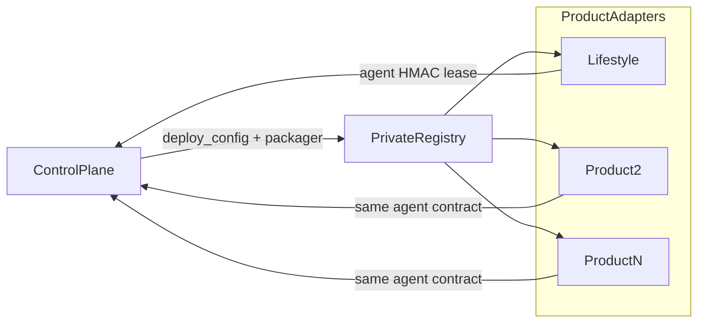
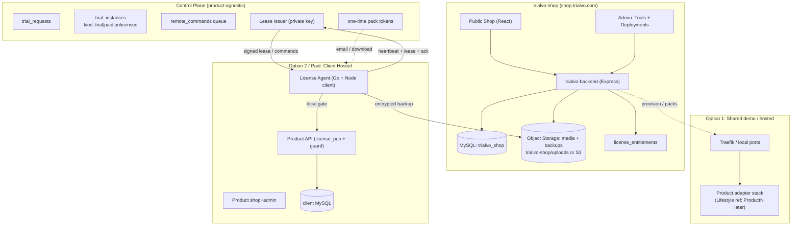

# Trialvo Trial Hosting & Control System — Master Implementation Plan

> **ডকুমেন্ট স্ট্যাটাস:** Authoritative source of truth. এই plan অনুযায়ী কাজ করতে হবে; dev time-এ scope পরিবর্তন এড়াতে সব সিদ্ধান্ত এখানে আগে থেকেই লিপিবদ্ধ।
> **Version:** 3.0.0
> **তৈরি:** 2026-07-10
> **শেষ আপডেট:** 2026-07-29
> **ভাষা নীতি:** ব্যাখ্যা বাংলায়, সব technical identifier / code / SQL / API / file path ইংরেজিতে।
> **পণ্য স্ট্যাটাস:** Lifestyle = **reference product** (Opt1/Opt2/paid E2E verified)। পরের product-গুলো একই Control Plane contract অনুসরণ করবে (§1.4 Product Adapter)।

---

## 0. মেটা তথ্য (Meta)

### 0.1 Repositories & Branches

| Repo | Path | Remote | Working Branch (এই কাজের জন্য) | Base |
|------|------|--------|-------------------------------|------|
| trialvo-shop | `d:\our product\trialvo-shop` | `git@github.com:trialvo/trialvo-shop.git` | `feature/trial-control-plane` | `shovo1` |
| products/product-1-lifestyle | `d:\our product\products\product-1-lifestyle` | `git@github.com:trialvo/shop-lifestyle.git` | `feature/trial-license-agent` | `shovo1` |

> **কেন `shovo1` থেকে branch?** উভয় repo-তে `shovo1` হলো `main`-এর থেকে এগিয়ে (lifestyle: +31, trialvo: +24 commit) এবং ০ পিছিয়ে। অর্থাৎ `shovo1`-ই latest এবং এখানেই বর্তমানে চলমান কোড।

### 0.2 এই plan যেভাবে ব্যবহার করবেন (For implementing models)

1. প্রতিটি টাস্কের একটি unique **Task ID** আছে (যেমন `TS-1.2`, `LS-3.1`, `INFRA-2`)।
2. টাস্ক শুরুর আগে তার **Depends On** কলাম দেখে নিশ্চিত হন dependency সম্পন্ন।
3. টাস্ক শেষে **Acceptance Criteria** যাচাই করুন, তারপর ledger-এ `Status` আপডেট করুন (`TODO → DOING → DONE`)।
4. কোনো টাস্কে অস্পষ্টতা পেলে **§17 Open Questions** দেখুন; সেখানে না থাকলে ডিফল্ট সিদ্ধান্ত (§4) অনুসরণ করুন।
5. Repo-প্রতি কাজ শুধু সেই repo-র নির্ধারিত branch-এ commit করুন।

---

## 1. ভিশন ও স্কোপ (Vision & Scope)

### 1.1 এক লাইনে

**trialvo-shop** (`shop.trialvo.com`) হবে আমাদের product marketplace ও কেন্দ্রীয় **multi-product control plane**, যেখান থেকে আমরা **Lifestyle**-এর মতো একাধিক real software product-এর **trial + paid deployment** deploy, detect, monitor, freeze/unfreeze, backup ও destroy করব — dynamically ও remotely।

### 1.2 মূল ডেলিভারেবল

1. **Dynamic Product Admin (CMS)** — product ছবি/দাম/বর্ণনা + `deploy_config` / `is_trialable`।
2. **Trial Request Flow** — Request Trial → approve/reject → Opt1 shared demo বা Opt2 installer।
3. **Trial Control Plane** — Opt1 shared demo; Opt2 client-hosted agent (lease/heartbeat/commands)।
4. **Paid Deployments Control** — purchase → entitlement + one-time pack download; admin **Deployments** dashboard (paid/unlicensed/conflict); domain-conflict freeze; transfer/convert APIs।
5. **Multi-product readiness** — Lifestyle reference; নতুন product = adapter + images + seed (§1.4)।

### 1.3 স্কোপে যা নেই (এখনও Out of Scope)

- Full multi-tenant SaaS billing automation (hooks আছে; full automation পরে)।
- Kubernetes orchestration (single-host Docker + Traefik দিয়ে চলছে; পরে scale)।
- Internet-wide unlicensed auto-discovery (agent phone-home ছাড়া detect অসম্ভব — honest residual)।
- Agent-stripped pirate copy remote control (ToS/docs-এ স্পষ্ট)।

### 1.4 Product Adapter Model (নতুন product যোগ করার চুক্তি)

> **কেন:** Lifestyle শুধু প্রথম product। Control Plane product-agnostic থাকবে; প্রতিটি product একটি **adapter** দিয়ে plug-in হবে।



**প্রতিটি নতুন product-এর জন্য করতে হবে (checklist):**

| # | কাজ | কোথায় |
|---|-----|--------|
| 1 | Catalog seed: `is_trialable=1`, `deploy_config` (image names, ports, shared-demo flags) | `trialvo-backend` seeds + admin CMS |
| 2 | Docker images: `{product}-api/admin/shop` (+ license-agent যদি Node/Go stack) | product repo `Dockerfile*` |
| 3 | Opt1: shared-demo compose **অথবা** per-product shared stack | `trialvo-shop/deploy/shared-demo/` বা `deploy/shared-demo-{slug}/` |
| 4 | Opt2/paid: installer template vars (`TRIAL_IMAGE_*`) বা product-specific template dir | `deploy/installer-template/` বা `installer-template-{slug}/` |
| 5 | License client: `licenseGuard` + `licenseClient` (বা equivalent) — `TRIAL_MODE` / `LICENSE_ENFORCE` | product API |
| 6 | Agent contract অপরিবর্তিত: register / heartbeat / lease / commands / backup | সব product একই CP API |
| 7 | Packager: `buildInstallerZip` / `buildPaidDockerZip` / `buildPaidCpanelZip` product slug অনুযায়ী image pick | `services/packager` |
| 8 | E2E scripts: trial Opt2 + paid smoke এই product-এর জন্য | `scripts/test-*-local.js` |

**Control Plane-এ যা product-specific নয় (শেয়ারড):** `trial_requests`, `trial_instances`, `license_entitlements`, agent auth, lease issuer, Deployments UI, lifecycle cron, pack download tokens।

**Lifestyle = reference implementation** — নতুন product কপি করে adapter বানানোর টেমপ্লেট।

---

## 2. পরিভাষা (Glossary)

| শব্দ | অর্থ |
|------|------|
| **Product Template** | trialvo-shop-এ তালিকাভুক্ত একটি product (যেমন Lifestyle) — ছবি, দাম, `deploy_config`, images। |
| **Product Adapter** | নতুন product যোগ করার চুক্তি (§1.4) — images + license client + seed; CP API একই। |
| **Trial Request** | Public ফর্মের মাধ্যমে আসা একটি অনুরোধ; admin approve করলে instance তৈরি হয়। |
| **Trial Instance** | চলমান deployment রেকর্ড — `instance_kind`: `trial` \| `paid` \| `unlicensed`। |
| **Shared Demo** | একক long-lived product stack; অনেক Opt1 trial একই shop/admin share করে। |
| **Trial Extend Pack** | পূর্ণ product কেনাকাটা থেকে আলাদা paid pack — `orders.order_kind='trial_extend'`। |
| **License Entitlement** | Paid purchase seat — `license_entitlements` (key hash, pack token hash, max_installs)। |
| **Deployments Dashboard** | Admin UI `/admin/deployments` — শুধু paid/unlicensed; Trial Instances থেকে আলাদা। |
| **Domain Conflict** | একই install secrets নতুন domain-এ → freeze + `meta.domain_conflict`। |
| **Control Plane** | trialvo-backend — instances, agent API, packs, lifecycle। |
| **License Agent** | Opt2/paid sidecar (Go gate + Node licenseClient) — heartbeat, lease, commands। |
| **License Lease** | RS256 short-lived JWT; API middleware ছাড়া protected route serve করে না। |
| **Freeze** | Panel/API ব্লক; ডেটা অক্ষত; reversible। |
| **Destroy** | Soft/hard teardown (+ pre-destroy backup)। |
| **Heartbeat** | Agent → CP status; default **10m**, pending command হলে **~30s** (adaptive)। |

---

## 3. সিস্টেম আর্কিটেকচার (Architecture)



### 3.1 পোর্ট ও ডোমেইন (স্মরণিকা)

| সার্ভিস | Local | Prod |
|---------|-------|------|
| trialvo-frontend | `:8000` (Vite) | `shop.trialvo.com` |
| trialvo-backend | `:5000` | `shop-api.trialvo.com` |
| trialvo-pay | `:8080` / `:8088` | `pay.trialvo.com` |
| MySQL (CP) | `:3307` | internal |
| Option 1 shared demo (Lifestyle) | shop `:5100`, admin `:5174`, API `:9100`, MySQL host `:23307` | prod subdomain বা fixed demo host |
| Option 1 per-trial | — | `*.trial.trialvo.com` (wildcard) |
| Private registry (local) | `:5300` (Windows Hyper-V `:5055` range এড়াতে) | `registry.trialvo.com` |
| Lifestyle (ref / Opt2) | shop `:5000`, admin `:5173`, api `:9000` | per-client |

---

## 4. মূল সিদ্ধান্তসমূহ (Finalized Decisions)

> এই সিদ্ধান্তগুলো ডিফল্ট হিসেবে চূড়ান্ত ধরা হলো যাতে dev time-এ থামতে না হয়। পরিবর্তন করতে হলে §18 Change Log-এ নথিভুক্ত করুন।

| # | সিদ্ধান্ত | চূড়ান্ত মান | যুক্তি |
|---|----------|-------------|--------|
| D1 | Option 1 hosting model | **ডিফল্ট (Lifestyle):** shared demo stack — এক compose, অনেক ADMIN ইউজার; destroy/freeze = revoke only। **ঐচ্ছিক scale path:** per-trial Docker Compose + Traefik + own MySQL | Shared demo সস্তা ও দ্রুত local/MVP; per-trial isolation পরে চাইলে |
| D2 | Trial default duration | **14 দিন** (admin Settings + per-request override) | সাধারণ SaaS trial দৈর্ঘ্য |
| D3 | Option 2 / paid delivery | **Docker images** (private registry) **অথবা** cPanel/Node pack; কোনো full source ZIP নয় (D18) | source ফাঁস/resell কঠিন করে; shared hosting সাপোর্ট |
| D4 | Backend protection | Docker image + **compiled License Agent (Go)** + **lease-based cryptographic gate** (public key baked in image) + `javascript-obfuscator` bundle | root access থাকলেও bypass কঠিন; realistic best-effort |
| D5 | Payment → trial | **Auto:** Trialvo Pay IPN → `trialActivation.activateFromPaidOrder` (extend pack বা full product) | MVP-তেই webhook চালু |
| D6 | Grace period (Option 2) | Agent/network fail হলে **24 ঘণ্টা** grace, তারপর freeze | সাময়িক নেটওয়ার্ক সমস্যায় client যেন হঠাৎ লক না হয় |
| D7 | Lease TTL | **2 ঘণ্টা**; Agent প্রতি **30 মিনিটে** নতুন lease আনে | freeze effect সর্বোচ্চ ~2 ঘণ্টার মধ্যে কার্যকর |
| D8 | Heartbeat interval | Steady **10 মিনিট** (`AGENT_HEARTBEAT_INTERVAL_SEC=600`); pending remote command থাকলে **~30s** adaptive | DB event storm এড়ানো + snappy control |
| D9 | Media/backup storage | **local:** `trialvo-shop/uploads/`; **prod:** S3/GCS via `STORAGE_DRIVER` | CMS + backup abstraction |
| D10 | Backup encryption | **AES-256-GCM** (+ v3 sealed codec); retention `BACKUP_KEEP_COUNT` (default 2) | storage খরচ কমায় |
| D11 | Agent ↔ Control Plane auth | per-instance **HMAC-SHA256** + optional `X-Nonce` + rate limit | spoof/replay কমানো |
| D12 | Trial admin role (Option 1) | শুধু **ADMIN** role seed; **SUPER_ADMIN** Trialvo-র গোপন | product ownership |
| D13 | DB migration style | trialvo: `migrations/NNN_*.js`; product DBs: product-native SQL | convention |
| D14 | Enforcement disclosure | Trial terms + honest residual (agent strip) | স্বচ্ছতা |
| D15 | Extend vs product buy | `order_kind=trial_extend` vs full product | প্যাক ≠ পুরো কেনা |
| D16 | Paid deployments | `instance_kind` + `license_entitlements`; admin Deployments UI; domain conflict freeze | clone/resell detect (agent থাকলে) |
| D17 | Paid pack delivery | Payment IPN → email + **one-time** `GET /api/license/pack/:token`; admin reissue (super_admin) | customer self-host path |
| D18 | Hosting packs | Docker compose **এবং** cPanel/Node pack (`USE_AGENT_GATE=0`) | shared hosting সাপোর্ট |
| D19 | Paid lifecycle | Trial auto soft-destroy after expiry; **paid never auto-destroy** by default (`PAID_DESTROY_AFTER_DAYS=0`) | paid seat ভুল করে মুছে না |
| D20 | Bootstrap / installer | Bootstrap **one-shot** after register; public installer **24h TTL + single-use**; admin password not in `agent.env` | secret blast radius |
| D21 | Multi-product | Lifestyle = reference adapter; নতুন product §1.4 checklist | scale catalog |
| D22 | Owner emergency lock | Product API obscure channel (not in client `.env`); private ops note only — **secrets এই plan-এ লেখা যাবে না** | manual kill-switch |
---

## 5. নিরাপত্তা ডিজাইন (Security Design)

### 5.1 Lease-based Enforcement (Option 2-এর মূল ভিত্তি)

**সমস্যা:** Client-এর নিজের server-এ root access থাকলে সে চাইলে code দেখতে/বদলাতে পারে। তাই "শুধু একটি env flag চেক" যথেষ্ট নয় — bypass করা সহজ হবে। আমরা একটি **cryptographic gate** ব্যবহার করব যেখানে enforcement remote private key-এর উপর নির্ভরশীল।

**নীতি (real-life analogy):** এটি অনেকটা প্রিপেইড বিদ্যুৎ মিটারের মতো — মিটার (Agent) কেন্দ্র থেকে recharge token (lease) না পেলে লাইন কেটে দেয়। গ্রাহক মিটার খুলতে পারে, কিন্তু বৈধ token বানাতে পারে না কারণ সেটি কেন্দ্রের গোপন চাবিতে (private key) স্বাক্ষরিত।

**প্রবাহ:**

```mermaid
sequenceDiagram
    participant Node as Lifestyle API
    participant Agent as License Agent
    participant CP as Control Plane

    loop প্রতি 30 মিনিট
        Agent->>CP: POST /api/agent/lease (HMAC signed)
        alt trial valid
            CP-->>Agent: License Lease (JWT, RS256, exp=2h)
        else frozen / expired
            CP-->>Agent: 200 {state:"frozen"} (কোনো valid lease নয়)
        end
    end

    Node->>Agent: GET http://127.0.0.1:AGENT_PORT/gate
    Agent-->>Node: current lease (বা "no valid lease")
    Note over Node: middleware RS256 public key দিয়ে<br/>lease verify করে; valid হলে serve, নাহলে 403
```

**মূল উপাদান:**

- **Key pair:** Control Plane-এ RSA/Ed25519 **private key** (lease sign করে)। Lifestyle Docker image-এ শুধু **public key** baked-in (`config/license_pub.pem`)।
- **Lease (JWT, RS256/EdDSA):** claims —
  ```json
  {
    "install_id": "uuid",
    "domain": "client-shop.com",
    "state": "active",         // active | frozen
    "features": ["catalog","orders","..."],
    "iat": 1700000000,
    "exp": 1700007200          // iat + 2h (D7)
  }
  ```
- **Middleware gate (Lifestyle):** প্রতিটি protected request-এ agent থেকে পাওয়া সর্বশেষ lease verify করে। শর্ত: signature বৈধ + `exp` ভবিষ্যতে + `state=="active"` + `domain` মেলে। ব্যর্থ হলে `403 { code: "TRIAL_LOCKED" }`।
- **Grace (D6):** Agent unreachable হলে middleware সর্বশেষ valid lease-এর `exp` + 24h পর্যন্ত মেনে নেয় (lease `exp` নয়, বরং "last good lease seen" + grace ট্র্যাক করে agent, Node-কে জানায়)। এতে সাময়িক নেটওয়ার্ক সমস্যায় লক হবে না।

> **নোট:** এটি bypass **অসম্ভব** করে না (root থাকলে কেউ image থেকে public key সরিয়ে middleware বদলাতে পারে), কিন্তু obfuscation + compiled agent + আইনি চুক্তির সাথে মিলিয়ে casual theft/resell অনেক কঠিন করে। §10.3 দেখুন।

### 5.2 Agent ↔ Control Plane Authentication (D11)

- প্রতিটি instance-এর একটি random `agent_secret` (৩২ bytes)। Provision-এর সময় তৈরি; Control Plane DB-তে encrypted, Agent config-এ plaintext (client host-এ)।
- প্রতিটি agent request-এ header:
  ```
  X-Install-Id: <install_id>
  X-Timestamp: <unix_ms>
  X-Signature: HMAC-SHA256(agent_secret, install_id + "." + timestamp + "." + body_sha256)
  ```
- Control Plane: timestamp ±5 মিনিটের মধ্যে (replay রোধ) + signature মেলে কিনা যাচাই করে।
- **ঐচ্ছিক hardening (D11/D20):** `X-Nonce` + in-memory rate limit; bootstrap token register-এর পর **consume**; public installer download **24h TTL + single-use**।
- Admin list/detail-এ `*_enc` ও registry token **redact** (super_admin credentials endpoint আলাদা)।

### 5.3 Secrets ও Key Management

| Secret | কোথায় থাকে | সুরক্ষা |
|--------|-----------|---------|
| Lease private key | Control Plane env `LICENSE_PRIVATE_KEY` (PEM) | কখনো client-এ যায় না |
| Lease public key | Product image `config/license_pub.pem` (Lifestyle ref) | public, ঝুঁকি নেই |
| `agent_secret` (per instance) | CP DB (AES encrypted) + client agent config | leak হলে শুধু ঐ instance affected |
| Bootstrap / installer tokens | one-shot / TTL | stolen ZIP blast radius কমায় |
| Pack download token | hash in `license_entitlements`; one-time HTTP | email leak-এ পুনরায় download বন্ধ |
| Backup encryption key (per instance) | CP DB (AES encrypted by master key) | master key CP env `BACKUP_MASTER_KEY` |
| Product `JWTSECRET`, SUPER_ADMIN pass | Trialvo provision করে, client জানে না (D12) | product ownership রক্ষা |
| Owner emergency lock | product-local obscure API; **secrets এই plan-এ নয়** | manual freeze/unlock (D22) |

### 5.4 বিদ্যমান দুর্বলতা যা এই কাজে ঠিক করতে হবে (Lifestyle)

`products/product-1-lifestyle` audit-এ পাওয়া (implementing model এগুলো খেয়াল রাখবে, তবে scope না বাড়িয়ে):

- Global rate limiter কমেন্ট করা আছে (`// app.use(globalLimiter)`) — Option 2 image-এ **enable** করা হবে (LS-4.x)।
- CORS wide open (`app.use(cors())`) — production image-এ origin restrict।
- Default `JWTSECRET="fish"` — provision-এ সবসময় random secret ইনজেক্ট (LS-5.x)।
- `GET /location-sync-tool` auth ছাড়া — production build-এ গার্ড/নিষ্ক্রিয়।

---

## 6. ডেটা মডেল (Data Models)

### 6.1 trialvo_shop (MySQL) — নতুন টেবিল

> **Runtime DB:** Control Plane = **MySQL** (`:3307` local)। নিচের কিছু পুরনো DDL উদাহরণে `JSONB` / `TIMESTAMPTZ` দেখা যেতে পারে — সেগুলো historical sketch; বাস্তব migration ফাইল MySQL dialect ব্যবহার করে (`024_license_deployments.js` ইত্যাদি)।
>
> Migration convention: `trialvo-backend/src/migrations/NNN_*.js`, তারপর `runner.js`-এ require যুক্ত করা (ক্রম গুরুত্বপূর্ণ)। সব migration idempotent (`IF NOT EXISTS`)।

#### 010_categories.js
```sql
CREATE TABLE IF NOT EXISTS categories (
  id CHAR(36) PRIMARY KEY,
  slug VARCHAR(100) NOT NULL UNIQUE,
  name JSONB NOT NULL,                 -- {bn, en}
  description JSONB DEFAULT NULL,
  icon VARCHAR(255) DEFAULT NULL,
  sort_order INT DEFAULT 0,
  is_active SMALLINT DEFAULT 1,
  created_at TIMESTAMPTZ DEFAULT NOW(),
  updated_at TIMESTAMPTZ DEFAULT NOW()
);
CREATE INDEX IF NOT EXISTS idx_categories_slug ON categories(slug);
CREATE INDEX IF NOT EXISTS idx_categories_active ON categories(is_active);
```
> `products.category` (VARCHAR) বিদ্যমান থাকবে; নতুন কোডে category slug রেফারেন্স করবে। data backfill: বিদ্যমান distinct `products.category` মান থেকে categories seed (TS-1.2)।

#### 011_media_assets.js
```sql
CREATE TABLE IF NOT EXISTS media_assets (
  id CHAR(36) PRIMARY KEY,
  kind VARCHAR(30) NOT NULL,           -- 'product_image' | 'thumbnail' | 'category_icon'
  owner_type VARCHAR(30) DEFAULT NULL, -- 'product' | 'category'
  owner_id CHAR(36) DEFAULT NULL,
  url VARCHAR(700) NOT NULL,
  storage_key VARCHAR(700) NOT NULL,   -- driver-relative path/key
  mime VARCHAR(100),
  size_bytes BIGINT,
  width INT, height INT,
  created_at TIMESTAMPTZ DEFAULT NOW()
);
CREATE INDEX IF NOT EXISTS idx_media_owner ON media_assets(owner_type, owner_id);
```

#### 012_product_deploy_config.js
```sql
-- Product template-কে deploy করার তথ্য (Option 1/2 উভয়ে ব্যবহৃত)
ALTER TABLE products ADD COLUMN IF NOT EXISTS deploy_config JSONB DEFAULT NULL;
-- deploy_config shape (application-enforced):
-- {
--   "image_api":   "registry.trialvo.com/lifestyle-api:v1.2.3",
--   "image_shop":  "registry.trialvo.com/lifestyle-shop:v1.2.3",
--   "image_admin": "registry.trialvo.com/lifestyle-admin:v1.2.3",
--   "db_seed_ref": "myecomv2_demo.sql",
--   "default_trial_days": 14,
--   "supports_option1": true,
--   "supports_option2": true,
--   "env_template": { "BRAND_NAME": "Demo Store" }
-- }
ALTER TABLE products ADD COLUMN IF NOT EXISTS is_trialable SMALLINT DEFAULT 0;
```

#### 013_trial_requests.js
```sql
CREATE TABLE IF NOT EXISTS trial_requests (
  id CHAR(36) PRIMARY KEY,
  public_token VARCHAR(64) NOT NULL UNIQUE,   -- status page + email link
  product_id CHAR(36) NOT NULL REFERENCES products(id),
  trial_type VARCHAR(20) NOT NULL,            -- 'hosted' (Opt1) | 'self_hosted' (Opt2)
  customer_name VARCHAR(150) NOT NULL,
  email VARCHAR(200) NOT NULL,
  phone VARCHAR(40) NOT NULL,
  company VARCHAR(200) DEFAULT NULL,
  desired_domain VARCHAR(255) DEFAULT NULL,    -- Opt2-তে client domain
  use_case TEXT DEFAULT NULL,
  requested_days INT DEFAULT 14,
  status VARCHAR(20) NOT NULL DEFAULT 'pending', -- pending|approved|rejected|provisioning|active|expired|cancelled
  admin_notes TEXT DEFAULT NULL,
  assigned_admin_id INT DEFAULT NULL,          -- admin_profiles.id
  ip_address VARCHAR(64) DEFAULT NULL,
  created_at TIMESTAMPTZ DEFAULT NOW(),
  approved_at TIMESTAMPTZ DEFAULT NULL,
  updated_at TIMESTAMPTZ DEFAULT NOW()
);
CREATE INDEX IF NOT EXISTS idx_trial_req_status ON trial_requests(status);
CREATE INDEX IF NOT EXISTS idx_trial_req_product ON trial_requests(product_id);
CREATE INDEX IF NOT EXISTS idx_trial_req_token ON trial_requests(public_token);
```

#### 014_trial_instances.js
```sql
CREATE TABLE IF NOT EXISTS trial_instances (
  id CHAR(36) PRIMARY KEY,
  install_id VARCHAR(64) NOT NULL UNIQUE,     -- Agent identity (Opt2) / internal id (Opt1)
  request_id CHAR(36) REFERENCES trial_requests(id),
  product_id CHAR(36) NOT NULL REFERENCES products(id),
  trial_type VARCHAR(20) NOT NULL,            -- hosted | self_hosted
  status VARCHAR(20) NOT NULL DEFAULT 'provisioning',
    -- provisioning|active|frozen|expired|destroying|destroyed|failed
  -- networking
  domain VARCHAR(255) DEFAULT NULL,           -- Opt2 client domain / Opt1 full subdomain
  subdomain VARCHAR(100) DEFAULT NULL,        -- Opt1 only
  shop_url VARCHAR(300) DEFAULT NULL,
  admin_url VARCHAR(300) DEFAULT NULL,
  api_url VARCHAR(300) DEFAULT NULL,
  -- access (Opt1 hosted admin creds)
  admin_email VARCHAR(200) DEFAULT NULL,
  admin_password_enc TEXT DEFAULT NULL,       -- AES-256-GCM
  -- security
  agent_secret_enc TEXT DEFAULT NULL,         -- AES-256-GCM (Opt2)
  backup_key_enc TEXT DEFAULT NULL,           -- AES-256-GCM (D10)
  -- lifecycle
  started_at TIMESTAMPTZ DEFAULT NULL,
  expires_at TIMESTAMPTZ DEFAULT NULL,
  frozen_at TIMESTAMPTZ DEFAULT NULL,
  last_heartbeat_at TIMESTAMPTZ DEFAULT NULL,
  last_lease_issued_at TIMESTAMPTZ DEFAULT NULL,
  agent_version VARCHAR(30) DEFAULT NULL,
  -- infra (Opt1)
  compose_project VARCHAR(100) DEFAULT NULL,
  host_node VARCHAR(100) DEFAULT NULL,
  meta JSONB DEFAULT NULL,
  created_at TIMESTAMPTZ DEFAULT NOW(),
  updated_at TIMESTAMPTZ DEFAULT NOW()
);
CREATE INDEX IF NOT EXISTS idx_trial_inst_status ON trial_instances(status);
CREATE INDEX IF NOT EXISTS idx_trial_inst_install ON trial_instances(install_id);
CREATE INDEX IF NOT EXISTS idx_trial_inst_expires ON trial_instances(expires_at);
```

#### 015_remote_commands.js
```sql
CREATE TABLE IF NOT EXISTS remote_commands (
  id CHAR(36) PRIMARY KEY,
  instance_id CHAR(36) NOT NULL REFERENCES trial_instances(id),
  command VARCHAR(30) NOT NULL,   -- freeze|unfreeze|extend|backup_now|restore|destroy_soft|destroy_hard|update_env
  payload JSONB DEFAULT NULL,     -- e.g. {days:7} | {backup_id:"..."}
  status VARCHAR(20) NOT NULL DEFAULT 'pending', -- pending|sent|acknowledged|succeeded|failed
  result JSONB DEFAULT NULL,
  created_by INT DEFAULT NULL,    -- admin_profiles.id
  created_at TIMESTAMPTZ DEFAULT NOW(),
  sent_at TIMESTAMPTZ DEFAULT NULL,
  acknowledged_at TIMESTAMPTZ DEFAULT NULL,
  completed_at TIMESTAMPTZ DEFAULT NULL
);
CREATE INDEX IF NOT EXISTS idx_rcmd_instance ON remote_commands(instance_id);
CREATE INDEX IF NOT EXISTS idx_rcmd_status ON remote_commands(status);
```

#### 016_instance_events.js
```sql
-- Heartbeat/audit log (append-only). উচ্চ ভলিউম রোধে retention cron (§14 Phase 6)।
CREATE TABLE IF NOT EXISTS instance_events (
  id BIGSERIAL PRIMARY KEY,
  instance_id CHAR(36) NOT NULL,
  event_type VARCHAR(30) NOT NULL, -- heartbeat|lease_issued|freeze|unfreeze|backup|error|status_change
  detail JSONB DEFAULT NULL,
  created_at TIMESTAMPTZ DEFAULT NOW()
);
CREATE INDEX IF NOT EXISTS idx_inst_events_inst ON instance_events(instance_id, created_at);
```

#### 017_instance_backups.js
```sql
CREATE TABLE IF NOT EXISTS instance_backups (
  id CHAR(36) PRIMARY KEY,
  instance_id CHAR(36) NOT NULL REFERENCES trial_instances(id),
  storage_key VARCHAR(700) NOT NULL,   -- encrypted blob location
  size_bytes BIGINT,
  checksum_sha256 VARCHAR(64),
  trigger VARCHAR(20) DEFAULT 'manual', -- manual|scheduled|pre_destroy
  status VARCHAR(20) DEFAULT 'pending', -- pending|uploading|completed|failed
  created_at TIMESTAMPTZ DEFAULT NOW(),
  completed_at TIMESTAMPTZ DEFAULT NULL
);
CREATE INDEX IF NOT EXISTS idx_backups_instance ON instance_backups(instance_id);
```

### 6.2 products/product-1-lifestyle (MySQL) — পরিবর্তন

Lifestyle DB-তে বড় schema পরিবর্তন লাগবে না; enforcement মূলত middleware + agent-এ। শুধু একটি local state টেবিল (fallback/observability):

#### scripts/trial_v1.sql (নতুন, idempotent)
```sql
CREATE TABLE IF NOT EXISTS license_state (
  id TINYINT PRIMARY KEY DEFAULT 1,
  install_id VARCHAR(64) DEFAULT NULL,
  state VARCHAR(20) NOT NULL DEFAULT 'active',  -- active|frozen
  last_lease_exp DATETIME DEFAULT NULL,
  last_good_lease_at DATETIME DEFAULT NULL,
  updated_at DATETIME DEFAULT CURRENT_TIMESTAMP ON UPDATE CURRENT_TIMESTAMP,
  CONSTRAINT chk_single_row CHECK (id = 1)
);
INSERT IGNORE INTO license_state (id, state) VALUES (1, 'active');
```
> মূল enforcement lease verify-এ; এই টেবিল শুধু last-known state cache ও admin panel display-এর জন্য। **Source of truth সবসময় remote lease।**

---

## 7. API কন্ট্রাক্ট (API Contracts)

> সব route `trialvo-backend` (Express)। বিদ্যমান base: `/api`। Auth middleware: `middleware/auth.js` → `authenticate` (JWT, admin_profiles)। নতুন agent auth middleware: `middleware/agentAuth.js` (HMAC, §5.2)।

### 7.1 Public API (auth ছাড়া)

#### POST /api/trial-requests
Trial ফর্ম submit। Rate-limited (IP-প্রতি 5/hour)।
```jsonc
// Request
{
  "productSlug": "lifestyle-ecommerce",
  "trialType": "hosted",            // hosted | self_hosted
  "name": "Rakib Hasan",
  "email": "rakib@example.com",
  "phone": "01700000000",
  "company": "Rakib Traders",       // optional
  "desiredDomain": "myshop.com",    // self_hosted হলে required
  "useCase": "Want to test before buying", // optional
  "requestedDays": 14                // optional, default product config
}
// Response 201
{ "ok": true, "requestId": "uuid", "statusToken": "abc123", "statusUrl": "https://shop.trialvo.com/trial-status/abc123" }
// Errors: 400 (validation), 404 (product/not trialable), 429 (rate limit)
```

#### GET /api/trial-status/:token
User-এর নিজের request status (gated data only)।
```jsonc
{ "status": "provisioning", "productName": {"en":"..."}, "trialType":"hosted",
  "expiresAt": null, "shopUrl": null, "adminUrl": null, "requestedAt": "..." }
```

### 7.2 Admin API (JWT, `/api/admin/*`)

> সবগুলো `router.use(authenticate)`-এর অধীনে (বিদ্যমান `routes/admin.js` প্যাটার্ন)। নতুন routes আলাদা router ফাইলে রেখে admin router-এ mount করা উত্তম (modularity)।

**Categories** (`routes/admin/categories.js`)
| Method | Path | কাজ |
|--------|------|-----|
| GET | `/api/admin/categories` | তালিকা |
| POST | `/api/admin/categories` | তৈরি |
| PUT | `/api/admin/categories/:id` | সম্পাদনা |
| DELETE | `/api/admin/categories/:id` | মুছে ফেলা (in-use হলে 409) |
| PUT | `/api/admin/categories/reorder` | sort_order আপডেট |

**Media** (`routes/admin/media.js`)
| Method | Path | কাজ |
|--------|------|-----|
| POST | `/api/admin/media/upload` | multipart `file` → sharp WebP → `trialvo-shop/uploads/{products\|categories}/` → `media_assets`; returns `{id,url}` (`url` relative `/uploads/...`) |
| POST | `/api/admin/media/cleanup` | body `{ urls[] }` — orphaned upload files + rows মুছে ফেলা |
| DELETE | `/api/admin/media/:id` | asset মুছে ফেলা |

**Trial Requests** (`routes/admin/trialRequests.js`)
| Method | Path | কাজ |
|--------|------|-----|
| GET | `/api/admin/trial-requests?status=&product=&q=` | filter/paginate তালিকা |
| GET | `/api/admin/trial-requests/:id` | বিস্তারিত |
| POST | `/api/admin/trial-requests/:id/approve` | approve → provision job enqueue। body: `{days?, notes?}` |
| POST | `/api/admin/trial-requests/:id/reject` | reject। body: `{reason}` |
| PATCH | `/api/admin/trial-requests/:id` | notes/assign আপডেট |

**Trial Instances** (`routes/admin/trialInstances.js`)
| Method | Path | কাজ |
|--------|------|-----|
| GET | `/api/admin/trial-instances?status=&type=&scope=` | তালিকা; `scope=trials` \| `deployments` |
| GET | `/api/admin/trial-instances/:id` | বিস্তারিত + events (secrets redact) |
| GET | `/api/admin/trial-instances/:id/events?type=` | event লগ (**heartbeat events লেখা হয় না**) |
| POST | `/api/admin/trial-instances/:id/freeze` | freeze command enqueue |
| POST | `/api/admin/trial-instances/:id/unfreeze` | unfreeze command enqueue |
| POST | `/api/admin/trial-instances/:id/extend` | body `{days}`; expires_at বাড়ে |
| POST | `/api/admin/trial-instances/:id/backup` | backup_now command enqueue |
| POST | `/api/admin/trial-instances/:id/restore` | body `{backupId}` + confirm |
| POST | `/api/admin/trial-instances/:id/destroy` | body `{mode:"soft"|"hard"}` + typed `DESTROY` |
| GET | `/api/admin/trial-instances/:id/credentials` | Opt1 admin creds (**super_admin**, audit-logged) |
| POST | `/api/admin/trial-instances/:id/reissue-pack` | paid pack token reissue (**super_admin**) |
| POST | `/api/admin/trial-instances/:id/convert-to-paid` | trial → paid seat (UI + API) |

**Public license pack** (`routes/licensePack.js`)
| Method | Path | কাজ |
|--------|------|-----|
| GET | `/api/license/pack/:token?format=docker\|cpanel` | one-time ZIP download; তারপর token invalidate |

### 7.3 Agent-facing API (HMAC auth, `/api/agent/*`)

> Middleware `agentAuth` (§5.2)। শুধু Option 2 self-hosted instance ব্যবহার করে।

#### POST /api/agent/register
প্রথম boot-এ। Provision-এ পাওয়া one-time `bootstrap_token` দিয়ে।
```jsonc
// Request (Authorization: Bearer <bootstrap_token>)
{ "installId": "uuid", "domain":"client-shop.com", "agentVersion":"1.0.0",
  "productVersion":"lifestyle@1.2.3" }
// Response 200
{ "ok": true, "heartbeatInterval": 600, "leaseInterval": 1800 }
```

#### POST /api/agent/heartbeat
```jsonc
// Request (HMAC headers; optional X-Nonce)
{ "installId":"uuid", "status":"running", "metrics":{"cpu":..,"mem":..},
  "localState":"active", "agentVersion":"1.0.0" }
// Response 200
{ "ok": true, "heartbeatInterval": 600,  // বা ~30 যদি pending commands থাকে
  "commands": [ {"id":"uuid","command":"freeze","payload":null} ] }
// Agent প্রতিটি command execute করে POST /api/agent/commands/:id/ack করবে
// নোট: heartbeat নিজে instance_events-এ লেখা হয় না (adaptive 10m + scale)
```

#### POST /api/agent/lease
```jsonc
// Request (HMAC)
{ "installId":"uuid" }
// Response 200 — valid হলে:
{ "state":"active", "lease":"<signed-JWT>", "expiresIn":7200 }
// frozen/expired হলে:
{ "state":"frozen", "lease":null }
```

#### POST /api/agent/commands/:id/ack
```jsonc
{ "installId":"uuid", "status":"succeeded", "result":{...} }
```

#### GET /api/agent/backup/upload-url  &  POST /api/agent/backup/complete
Backup আপলোডের presigned URL ও completion report (S3 driver)। local driver হলে `POST /api/agent/backup/blob` (multipart)।

---

## 8. License Agent ডিজাইন (Go sidecar)

> **কেন Go?** একক static binary-তে compile হয় (কোনো interpreter/source নয়), cross-platform, ছোট। Client শুধু binary পায় — bypass কঠিন (D4)।

### 8.1 দায়িত্ব
1. প্রথম boot-এ `register` (bootstrap one-shot)।
2. Steady **10 মিনিট** `heartbeat` (pending command থাকলে **~30s**) → commands execute।
3. প্রতি ~15–30 মিনিটে `lease` fetch → memory + disk cache (`/agent/lease.jwt`)।
4. Local gate — product API-কে current lease দেয় (Go gate এবং/অথবা Node `licenseClient`)।
5. Commands: freeze/unfreeze, backup_now, destroy, extend (নতুন lease)।

### 8.2 Config (`agent.env`, provision-এ তৈরি)
```
CONTROL_PLANE_URL=https://shop-api.trialvo.com
INSTALL_ID=<uuid>
AGENT_SECRET=<32-byte hex>       # HMAC
BOOTSTRAP_TOKEN=<one-time>       # first register only
BACKUP_KEY=<32-byte hex>         # AES-256-GCM
AGENT_PORT=9911
DB_HOST=... DB_PORT=... DB_USER=... DB_PASSWORD=... DB_NAME=ecom
COMPOSE_PROJECT=trial-<slug>-<short>
```

### 8.3 Freeze প্রয়োগের স্তর (defense in depth)
| স্তর | পদ্ধতি | প্রভাব |
|------|--------|--------|
| L1 (primary) | Node middleware lease invalid → 403 সব protected route | API অকার্যকর |
| L2 | Agent shop/admin container `stop` (docker socket) বা proxy maintenance page | UI ডাউন |
| L3 (destroy) | Agent `compose down` / volume rm (mode অনুযায়ী) | সম্পূর্ণ অপসারণ |

> L1 সবসময় থাকবে (cryptographic)। L2/L3 agent-এর docker access-এর উপর নির্ভর; না থাকলেও L1 যথেষ্ট কার্যকর।

### 8.4 Repo layout (Lifestyle repo-তে নতুন ফোল্ডার)
```
products/product-1-lifestyle/
└── license-agent/            # Go module (নতুন)
    ├── main.go
    ├── internal/client/      # CP HTTP client (HMAC)
    ├── internal/gate/        # localhost lease server
    ├── internal/commands/    # freeze/backup/destroy executors
    ├── internal/lease/       # cache + verify helpers
    ├── Dockerfile            # multi-stage → scratch/distroless
    └── go.mod
```

---

## 9. Option 1 — Trialvo Hosted Provisioning

### 9.1 Shared Demo প্রবাহ (বর্তমান Lifestyle ডিফল্ট)
```
submit (async 201) → confirmation page /trial-request-submitted
  → background: auto-approve (যদি Settings) বা admin approve
  → sharedDemoProvisioner: ensure shared stack + create/reactivate ADMIN
  → email status-page link only (no raw creds in mail)
  → status page: credentials modal + Browse demo shop
expire/freeze/destroy → revokeTrialAdmin (is_active=0); compose stays up
```

- Env: `SHARED_DEMO_*` (`SHARED_DEMO_SHOP_URL`, `ADMIN_URL`, `API_URL`, MySQL host port **23307** — Windows Hyper-V `:13307` range এড়াতে)।
- Compose: `trialvo-shop/deploy/shared-demo/` (license-agent নেই)।
- Dedup: একই **email + product + trial_type** পুনরায় submit হলে existing status; আলাদা product বা Opt1+Opt2 OK।

### 9.2 Per-trial Docker প্রবাহ (ঐচ্ছিক / scale)
```
approve → provision job → allocate subdomain → render compose from template
  → docker compose up (isolated project) → wait healthy → import demo DB
  → create ADMIN admin (no SUPER_ADMIN) → set expires_at → email
  → status=active
```

- **Provisioner:** `services/dockerProvisioner.js` / `provisioner/` — `DOCKER_PROVISION=1`।
- **Template:** `deploy/templates/lifestyle/docker-compose.tmpl.yml`।
- **Reverse proxy:** Traefik + `*.trial.trialvo.com` (INFRA)।

### 9.3 Isolation নীতি
- **Shared demo:** isolation = আলাদা ADMIN ইউজার + revoke; DB/volumes shared।
- **Per-trial:** আলাদা compose + MySQL + volume + password।

### 9.4 Paid extend vs product buy
| পথ | URL / kind | দাম | দিন |
|-----|------------|-----|-----|
| Extend pack | `/checkout?extend=1&trialInstance=…` → `order_kind=trial_extend` | `trial_extend_price_bdt` (server-authoritative) | `orders.extend_days` ← `trial_extend_days` |
| Full product | `/checkout?product=…&trialInstance=…` → `order_kind=product` | product `price_bdt` | convert: `trial_paid_extend_days` |
| Admin Settings | `/admin/settings` Trial section | extend days + BDT/USD | separately from Opt1/Opt2 free periods |

Migration: `023_trial_extend_pack.js` (`orders.order_kind`, `orders.extend_days`, config keys)।

---

## 10. Option 2 — Client Hosted Packaging & Protection

### 10.1 Installer প্যাকেজ (client যা পায়)
```
trialvo-lifestyle-trial/
├── docker-compose.yml        # pre-built image refs (registry.trialvo.com/...), NO source
├── agent.env                 # provision-এ pre-filled (install_id, secrets)
├── .env                      # DB creds, domain (client পূরণ করে অল্প কিছু)
├── license-agent             # compiled Go binary (বা image ref)
├── setup.sh / setup.ps1      # docker login (scoped token) + compose up
└── TRIAL_TERMS.md            # License Agent + freeze আচরণ স্পষ্ট (D14)
```

### 10.2 Image delivery
- Images push হয় **private registry** (`registry.trialvo.com`)।
- Client-কে দেওয়া হয় **scoped, short-lived pull token** (trial সময়ের জন্য)। Trial শেষে token revoke → client নতুন করে pull করতে পারে না।

### 10.3 Backend protection স্তর (D4 — বাস্তব প্রত্যাশা)
| স্তর | পদ্ধতি | কার্যকারিতা | নোট |
|------|--------|-------------|-----|
| 1 | Source নয়, শুধু Docker image | ★★★★ | primary |
| 2 | `javascript-obfuscator` দিয়ে backend bundle | ★★ | source extract করলেও পড়া কঠিন |
| 3 | Lease cryptographic gate (§5.1) | ★★★★ | remote private key নির্ভর |
| 4 | Compiled Go agent (enforcement যুক্তি binary-তে) | ★★★ | patch কঠিন |
| 5 | Scoped registry token, trial শেষে revoke | ★★★ | পুনঃব্যবহার রোধ |
| 6 | আইনি Trial License Agreement | ★★★★ | resell-এর বিরুদ্ধে আইনি রক্ষা |

> **সৎ মূল্যায়ন:** root access থাকলে 100% সুরক্ষা অসম্ভব। উপরের স্তরগুলো একত্রে casual copy/resell কে অর্থনৈতিক ও কারিগরিভাবে অলাভজনক করে। **সর্বোচ্চ সুরক্ষা চাইলে ভবিষ্যতে "backend Trialvo-তে, client শুধু frontend" (SaaS) মডেল** (§17 F1)।

---

## 11. Backup / Restore

- **Dump:** `mysqldump ecom` + `uploads/` ডিরেক্টরি tar → একক archive।
- **Encrypt:** AES-256-GCM, per-instance `backup_key` (D10)।
- **Upload:** presigned URL (S3) বা multipart (local)। রেকর্ড `instance_backups`।
- **Schedule:** daily (Option 2 agent cron) + pre-destroy বাধ্যতামূলক backup।
- **Restore:** admin `restore {backupId}` → command → agent download → decrypt → `mysql < dump` + uploads restore।

---

## 12. Frontend (trialvo-frontend) — Pages ও Components

### 12.1 Public
| উপাদান | ফাইল (নতুন/সম্পাদনা) | কাজ |
|--------|----------------------|-----|
| Request Trial button + modal | `src/components/trial/RequestTrialModal.tsx` (নতুন) | ProductDetailPage-এ CTA; hosted/self_hosted টগল |
| Trial form | `src/components/trial/TrialRequestForm.tsx` (নতুন) | নাম/ফোন/ইমেইল/domain/use_case, validation |
| Status page | `src/pages/TrialStatusPage.tsx` + `/trial-status/:token` | status, credentials modal, **Extend trial** vs **Buy product** CTAs |
| Submit confirmation | `TrialRequestSubmittedPage` + `/trial-request-submitted` | দ্রুত 201-এর পর; email-এ status link |
| ProductDetailPage | `src/pages/ProductDetailPage.tsx` | Request Trial + demo shop; media via `resolveMediaUrl` |
| CategoriesSection fix | `src/components/sections/CategoriesSection.tsx` | static array → API data |

### 12.2 Admin (`/admin/*`)
| উপাদান | ফাইল | কাজ |
|--------|------|-----|
| Product image upload | `AdminProductsPage.tsx`, `ImageUploadButton`, `mediaUrl.ts` | upload → `trialvo-shop/uploads/products|categories`, cleanup on replace/delete, storefront preview |
| Category management | `src/pages/admin/AdminCategoriesPage.tsx` + route | CRUD + reorder |
| Trial requests | `src/pages/admin/AdminTrialRequestsPage.tsx` | তালিকা, approve/reject, notes |
| Trial instances dashboard | `src/pages/admin/AdminTrialInstancesPage.tsx` | শুধু **trials**; freeze/unfreeze/extend/backup/destroy; shared-demo badge |
| Deployments dashboard | `src/pages/admin/AdminDeploymentsPage.tsx` | **paid/unlicensed**; conflict badge; typed destroy; restore confirm; convert-to-paid; reissue pack |
| Trial Settings | `AdminSettingsPage.tsx` | Opt1/Opt2 days, **extend pack** days/price, convert days, SMTP, kill switch |
| Instance detail drawer | `src/components/admin/InstanceDetail.tsx` | event timeline, creds (Opt1), actions |
| Nav links | `src/components/admin/AdminLayout.tsx` | Trials + Deployments আলাদা menu |
| API hooks | `useTrialRequests`, `useTrialInstances`, `useCategories`, `useMedia` | TanStack Query; list `scope=` |

### 12.3 UI নীতি (user rules মেনে)
- Modern, minimal, পরিষ্কার visual hierarchy; responsive (desktop/tablet/mobile)।
- Destructive action (destroy) — confirm dialog + টাইপ-করা নিশ্চিতকরণ।
- Instance status color + icon উভয়ে (accessibility, শুধু রঙ নয়)।

---

## 13. ইমেইল / নোটিফিকেশন

| ইভেন্ট | প্রাপক | মাধ্যম |
|--------|--------|--------|
| Trial request received | user + admin | email; admin panel badge |
| Request approved (Opt1) | user | email with shop/admin URL + credentials |
| Request approved (Opt2) | user | email with installer download + setup guide |
| Trial expiring (T-3, T-1 দিন) | user | email reminder |
| Trial expired / frozen | user | email |
| Instance error/offline | admin | email + panel alert |
| Paid purchase (IPN) | buyer | license key + **one-time pack download link** (`/api/license/pack/:token`) |
| Pack reissue (admin) | buyer | নতুন one-time link (পুরনো invalidate) |

> SMTP: trialvo-backend `services/mailer.js` (nodemailer)। Env: `SMTP_*`। Ops: `docs/OPS_LICENSE_RUNBOOK.md`।

---

## 14. Implementation Ledger (টাস্ক লেজার)

> **Status মান:** `TODO` | `DOING` | `DONE` | `BLOCKED`। implementing model কাজ শেষে এই টেবিল আপডেট করবে।
> **Repo কোড:** `T` = trialvo-shop (`feature/trial-control-plane`), `L` = products/product-1-lifestyle (`feature/trial-license-agent`), `I` = infra/both। নতুন product = নিজস্ব repo কোড + একই CP (`MP-7.*`)।
>
> **নির্ধারিত sequencing (মালিকের সিদ্ধান্ত, 2026-07-10):**
> 1. **Phase 1 আগে** শুরু (Product CMS + Lifestyle onboarding) — কম ঝুঁকি, দ্রুত দৃশ্যমান ফল।
> 2. তারপর **Phase 3 (Option 1 hosted) ও Phase 4 (Option 2 client-hosted) সমান্তরালে**।
> 3. **Phase 7 (paid + hardening)** Lifestyle-এর উপর verified — এখন **multi-product** = §1.4 + `MP-7.2+`।

### Phase 0 — Foundation & Prep

| Task ID | Repo | কাজ | Files | Depends | Acceptance | Status |
|---------|------|-----|-------|---------|------------|--------|
| P0-1 | I | Fresh branches তৈরি | — | — | দুই repo-তে নির্ধারিত branch আছে | DONE |
| P0-2 | I | এই plan root-এ সংরক্ষণ | `TRIAL_SYSTEM_PLAN.md` | — | ফাইল বিদ্যমান ও পঠনযোগ্য | DONE |
| P0-3 | T | Lease key pair | `deploy/keys/` | — | auto-generated on startup | DONE |
| P0-4 | T | `services/mailer.js` — admin SMTP via `system_config` (migration 019); stub if disabled/no host | `services/mailer.js`, `services/smtpSettings.js`, Settings→Email | — | admin-configurable SMTP; stub when off | DONE |
| P0-5 | T | Crypto util | `utils/crypto.js` | — | AES/HMAC helpers | DONE |

### Phase 1 — Product CMS + Lifestyle Onboarding (trialvo-shop)

| Task ID | Repo | কাজ | Files | Depends | Acceptance | Status |
|---------|------|-----|-------|---------|------------|--------|
| TS-1.1 | T | `010_categories` migration + runner register | `migrations/010_categories.js`, `migrations/runner.js` | — | migrate করলে টেবিল তৈরি | DONE |
| TS-1.2 | T | Categories seed from distinct product categories + controller/routes | `controllers/categoryController.js`, `routes/admin/categories.js`, `routes/categories.js`, `seeds/categorySeed.js` | TS-1.1 | admin CRUD কাজ করে; public list API | DONE (login+create+list+delete verified) |
| TS-1.3 | T | `011_media_assets` migration + upload service (resize via sharp) + routes | `migrations/011_media_assets.js`, `services/storage.js`, `controllers/mediaController.js`, `routes/admin/media.js` | — | file upload → URL ফেরত; local + S3 drivers | DONE (S3 via STORAGE_DRIVER=s3) |
| TS-1.4 | T | `012_product_deploy_config` migration (deploy_config, is_trialable) | `migrations/012_product_deploy_config.js` | — | কলাম যুক্ত; productController তা read/write | DONE |
| TS-1.5 | T | productController: deploy_config + is_trialable CRUD সাপোর্ট | `controllers/productController.js` | TS-1.4 | valid save; JSON/bool coercion | DONE (lightweight manual validation; zod বাদ — codebase minimal-dep নীতি, §18 v1.1.0) |
| TS-1.6 | T | Admin UI: image upload যুক্ত | `frontend/src/pages/admin/AdminProductsPage.tsx`, `hooks/useMedia.ts`, `components/admin/ImageUploadButton.tsx`, `lib/api.ts` | TS-1.3 | ছবি আপলোড ও preview | DONE (thumbnail + screenshots upload) |
| TS-1.7 | T | Admin UI: Categories page + nav | `frontend/src/pages/admin/AdminCategoriesPage.tsx`, `AdminLayout.tsx`, `App.tsx`, `hooks/useCategories.ts` | TS-1.2 | CRUD UI কাজ করে | DONE (typecheck clean) |
| TS-1.8 | T | CategoriesSection static→API | `frontend/src/components/sections/CategoriesSection.tsx` | TS-1.2 | count API থেকে আসে | DONE |
| TS-1.9 | T | Lifestyle product seed (auto upsert) | `seeds/lifestyleProductSeed.js` | TS-1.6 | Lifestyle on storefront with is_trialable | DONE |

### Phase 2 — Trial Request Flow

| Task ID | Repo | কাজ | Files | Depends | Acceptance | Status |
|---------|------|-----|-------|---------|------------|--------|
| TS-2.1 | T | `013_trial_requests` migration | `migrations/013_trial_requests.js` | — | টেবিল তৈরি | DONE |
| TS-2.2 | T | Public request + rate limit | `controllers/trialRequestController.js`, `routes/trials.js` | TS-2.1, P0-4 | POST create + mail stub | DONE |
| TS-2.3 | T | Status endpoint | same | TS-2.1 | token status | DONE |
| TS-2.4 | T | Admin trial-requests routes | `controllers/adminTrialController.js`, `routes/admin/trialRequests.js` | TS-2.1 | approve→provision | DONE |
| TS-2.5 | T | RequestTrialModal on ProductDetail | `RequestTrialModal.tsx`, `ProductDetailPage.tsx` | TS-2.2 | form submit | DONE |
| TS-2.6 | T | TrialStatusPage (+ credentials when active) | `TrialStatusPage.tsx`, `App.tsx`, status API | TS-2.3 | status page + login creds | DONE |
| TS-2.7 | T | AdminTrialRequestsPage (+ days dialog) | `AdminTrialRequestsPage.tsx`, nav | TS-2.4 | approve/reject with period | DONE |
| TS-2.8 | T | Trial settings: auto-approve Opt1 + period Opt1/Opt2 | `018_trial_settings.js`, `trialSettings.js`, Settings→Trials | TS-2.2 | admin toggles; hosted auto-provision | DONE |
| TS-2.9 | T | Status API returns credentials when trial granted | `trialRequestController.js` | TS-2.3 | token page shows admin email/password | DONE |

### Phase 3 — Option 1 Hosted Provisioning

| Task ID | Repo | কাজ | Files | Depends | Acceptance | Status |
|---------|------|-----|-------|---------|------------|--------|
| INFRA-1 | I | Prod Traefik | `deploy/infra/docker-compose.traefik.yml` | — | Traefik compose ready on host | DONE |
| INFRA-2 | I | Wildcard DNS | `deploy/infra/DNS_WILDCARD.md` | INFRA-1 | DNS checklist + hosts fallback | DONE (ops apply at deploy) |
| TS-3.1 | T | instances/commands/events migrations | `014-016` | — | applied | DONE |
| TS-3.2 | T | Compose template | `deploy/templates/lifestyle/docker-compose.tmpl.yml`, `composeTemplate.js` | — | template renderable | DONE |
| TS-3.3 | T | Provisioner MVP + Docker | `provisioner.js`, `dockerProvisioner.js` | TS-3.1 | approve→instance; Docker when `DOCKER_PROVISION=1` | DONE |
| TS-3.4 | T | approve→provisioner | adminTrialController | TS-3.3 | instance active | DONE |
| TS-3.5 | T | Expiry cron | `cron/trialLifecycle.js` | TS-3.4 | hourly expire→freeze cmd | DONE |
| TS-3.6 | T | AdminTrialInstancesPage | `AdminTrialInstancesPage.tsx` | TS-3.4 | freeze/unfreeze/extend | DONE |
| L-3.1 | L | Docker images | `Back End/Dockerfile`, `admin panel/Dockerfile`, `shop panel/Dockerfile`, `deploy/build-images.sh` | — | api/admin/shop(+agent) buildable | DONE |
| L-3.2 | L | Demo DB seed | `deploy/seed-demo-db.sh`, `scripts/trial_admin_seed.sql` | — | seed script for MySQL | DONE |
| L-3.3 | L | ADMIN seed script | provisioner + trial_admin_seed | — | provisioner generates creds | DONE |

### Phase 4 — License Agent + Option 2 Enforcement

| Task ID | Repo | কাজ | Files | Depends | Acceptance | Status |
|---------|------|-----|-------|---------|------------|--------|
| TS-4.1 | T | Agent HMAC auth | `middleware/agentAuth.js` | P0-5 | invalid sig 401 | DONE |
| TS-4.2 | T | Agent endpoints | `controllers/agentController.js`, `routes/agent.js` | TS-3.1 | register/heartbeat/lease/ack | DONE |
| TS-4.3 | T | Lease issuer RS256 | `services/leaseIssuer.js` | P0-3 | signed JWT lease | DONE |
| L-4.1 | L | `trial_v1.sql` | `scripts/trial_v1.sql` | — | license_state table | DONE |
| L-4.2 | L | licenseGuard + embedded Node client | `middleware/licenseGuard.js`, `services/licenseClient.js` | L-4.1 | TRIAL_MODE=1 enforcement | DONE |
| L-4.3 | L | Public key via env/file | `LICENSE_PUBLIC_KEY` or `config/license_public.pem` | P0-3 | verify lease | DONE |
| L-4.4 | L | Go agent | `license-agent/` (main + client/gate/commands/lease) | — | Go sidecar compiles in Docker | DONE |
| L-4.5 | L | freeze/unfreeze via heartbeat commands | licenseClient.js + Go commands | L-4.2 | remote freeze works | DONE |
| L-4.6 | L | Agent Dockerfile | `license-agent/Dockerfile` | L-4.4 | multi-stage distroless image | DONE |
| L-4.7 | L | Prod hardening (rate limit, CORS) | `middleware/trialHardening.js`, index.js | — | trial CORS allowlist + global limiter | DONE |

### Phase 5 — Backup/Restore + Packaging

| Task ID | Repo | কাজ | Files | Depends | Acceptance | Status |
|---------|------|-----|-------|---------|------------|--------|
| TS-5.1 | T | `017_instance_backups` migration | `migrations/017_instance_backups.js` | — | টেবিল তৈরি | DONE (schema only; upload flow still TS-5.2) |
| TS-5.2 | T | Backup endpoints (upload-url/complete/blob) + storage | `backupService.js`, `agentController.js`, `storage.js` | TS-5.1 | agent backup upload হয় | DONE (local driver) |
| TS-5.3 | T | Restore command flow (admin→command→agent) | `adminTrialController.js`, agent download | TS-5.2 | restore command enqueue + download | DONE (MVP decrypt/manifest; full SQL import later) |
| L-5.1 | L | Agent backup command (mysqldump+uploads, AES-GCM, upload) | `licenseClient.js` v2 + Go agent command hook | L-4.4, TS-5.2 | encrypted backup CP-তে | DONE (v2) |
| L-5.2 | L | Agent restore command (download, decrypt, import) | `licenseClient.js` restore: uploads write-back + mysql import when CLI present | L-5.1 | restore data সঠিক | DONE (v2 best-effort import) |
| L-5.3 | L | Agent destroy command (soft/hard) + pre-destroy backup | `licenseClient.js` + Go compose down + CP Opt1 docker destroy | L-5.1 | destroy আগে backup | DONE |
| TS-5.4 | T | Installer package generator (Opt2) + scoped registry token | `services/packager/`, `deploy/installer-template/` (+ license-agent service) | TS-4.2, L-3.1 | download-যোগ্য installer | DONE |
| TS-5.5 | T | Obfuscate backend bundle in prod image build | `deploy/obfuscate-backend.js`, `Dockerfile.trial`, `build-images.sh` | L-3.1 | image-এ obfuscated bundle | DONE |

### Phase 6 — Polish, Payment, Analytics

| Task ID | Repo | কাজ | Files | Depends | Acceptance | Status |
|---------|------|-----|-------|---------|------------|--------|
| TS-6.1 | T | Expiry reminder emails (T-3, T-1) | `cron/trialLifecycle.js`, `trialEmails.js`, instance `meta` dedup | TS-3.5 | reminder পাঠানো হয় | DONE |
| TS-6.2 | T | Trialvo Pay webhook → auto-unfreeze/extend on payment | `paymentController.js`, `trialActivation.js`, `020_order_trial_instance` | TS-3.6 | payment→auto unfreeze | DONE |
| TS-6.3 | T | Admin analytics: active trials, conversion, uptime | `trialAnalyticsController.js`, Instances + Dashboard UI | TS-3.6 | metrics দৃশ্যমান | DONE |
| TS-6.4 | T | instance_events retention cron | `cron/eventsRetention.js` | TS-3.1 | পুরনো events prune | DONE (90d default) |
| TS-6.5 | T | Agent version check + auto-update notice | `agentVersion.js`, heartbeat/register, UI flag | TS-4.4 | পুরনো agent flag | DONE |
| TS-6.6 | T | Shared demo Option 1 (Lifestyle) | `sharedDemoProvisioner.js`, `deploy/shared-demo/`, revoke on destroy | TS-3.2 | Opt1 = ADMIN grant/revoke, no compose down | DONE |
| TS-6.7 | T | Async trial submit + confirmation UX | `trialRequestController` setImmediate, `/trial-request-submitted`, slim emails | TS-2.x | fast 201 + status link email | DONE |
| TS-6.8 | T | Separate trial extend pack vs product buy | `023_trial_extend_pack`, Settings, Checkout `extend=1`, Status CTAs, IPN days | TS-6.2 | admin days/price; product checkout unchanged | DONE |
| TS-6.9 | T | Product media root uploads + cleanup | `storage.js` → `trialvo-shop/uploads`, `mediaCleanup.js`, AdminProductsPage, `resolveMediaUrl` | TS-1.3 | upload/replace/delete clean; detail page shows images | DONE |

### Phase 7 — Paid Deployments, Hardening, Multi-product

| ID | Repo | Task | Primary files | Depends | Acceptance | Status |
|----|------|------|---------------|---------|------------|--------|
| TS-7.1 | T | `instance_kind` + `license_entitlements` migration | `024_license_deployments.js` | TS-3.1 | schema applied | DONE |
| TS-7.2 | T | Entitlements + domain conflict + paid provision | `licenseEntitlements.js`, agent register/lease | TS-7.1 | conflict → freeze | DONE |
| TS-7.3 | T | Admin Deployments UI + scope split | `AdminDeploymentsPage.tsx`, list `scope=` | TS-7.1 | trials ≠ deployments | DONE |
| TS-7.4 | T | One-time customer pack download + IPN email | `licensePackDelivery.js`, `/api/license/pack` | TS-7.2 | download once → 401 replay | DONE |
| TS-7.5 | T | Adaptive heartbeat; no heartbeat event spam | `agentController.js` | TS-4.2 | default 600s; events not written | DONE |
| TS-7.6 | T | Paid-safe lifecycle + compose `TRIAL_MODE` | `trialLifecycle.js`, installer-template | TS-3.5 | paid not auto-destroyed | DONE |
| TS-7.7 | T | Bootstrap consume + installer TTL/single-use + redact list | `agentAuth.js`, trial installer, admin list | TS-5.4 | stolen ZIP limited | DONE |
| TS-7.8 | T | Admin roleAuth + typed destroy + convert UI | `trialInstances` routes, Deployments UI | TS-7.3 | super_admin for pack/creds | DONE |
| TS-7.9 | T | Ops runbook | `docs/OPS_LICENSE_RUNBOOK.md` | TS-7.4 | prod checklist | DONE |
| L-7.1 | L | `LICENSE_ENFORCE` + Node license client 1.5 | `licenseGuard.js`, `licenseClient.js` | L-4.2 | paid packs enforce | DONE |
| L-7.2 | L | Owner emergency lock (product-local) | `svOperatorLock.js` — **secrets not in this plan** | — | freeze/unlock/destroy via obscure API | DONE |
| MP-7.1 | I | Document Product Adapter checklist | §1.4 this plan | — | next product can follow | DONE |
| MP-7.2 | I | Second product onboard (TBD slug) | new repo + seed + images | MP-7.1 | Opt1 or Opt2 E2E on product #2 | TODO |
| MP-7.3 | T | Packager multi-product image map from `deploy_config` | `packager/index.js` | MP-7.1 | slug → images without hardcode-only Lifestyle | TODO |
| MP-7.4 | T | Shared-demo provisioner per product slug | `sharedDemoProvisioner.js` | MP-7.2 | Opt1 works for product #2 | TODO |

---

## 15. টেস্টিং কৌশল (Testing)

| স্তর | কী টেস্ট | টুল |
|------|----------|-----|
| Unit | crypto (AES/HMAC), lease sign/verify, validation | jest (trialvo), go test (agent) |
| Integration | trial request→approve→instance, agent register→heartbeat→lease | supertest + test DB |
| E2E (Opt1) | approve→live subdomain→login→expire→freeze | staging host + Traefik |
| E2E (Opt2) | installer→register→heartbeat→admin freeze→panel locked→unfreeze | throwaway VPS/VM |
| Security | forged lease reject, HMAC replay reject, expired token 403 | manual + automated |
| Freeze drill | freeze কমান্ডের পর সর্বোচ্চ lease TTL (2h) এর মধ্যে লক | timed test |

**Definition of Done (প্রতি phase):** সংশ্লিষ্ট acceptance criteria pass + ReadLints clean + সংশ্লিষ্ট branch-এ commit (ইংরেজি commit message, user rules)।

---

## 16. রোলআউট ও রোলব্যাক

- প্রতিটি phase আলাদাভাবে deploy-যোগ্য; trialvo-backend migration auto-run (startup)।
- **রোলব্যাক:** migration গুলো additive (drop নয়) — কোড রিভার্ট করলেই নিরাপদ। নতুন টেবিল থাকলেও পুরনো কোড ভাঙবে না।
- Feature flag: নতুন public "Request Trial" CTA একটি config flag-এর পেছনে (`system_config: trials_enabled`) যাতে প্রয়োজনে দ্রুত বন্ধ করা যায়।
- Option 2 / paid enforcement: `TRIAL_MODE=1` (trial) বা `LICENSE_ENFORCE=1` (paid); নিজের internal Lifestyle demo-তে ভুল করে লক এড়াতে flag স্পষ্ট রাখুন।
- Multi-product: নতুন slug যোগ করার আগে §1.4 checklist + `MP-7.2`–`MP-7.4`।

---

## 17. ঝুঁকি, প্রশমন ও Open Questions

### 17.1 ঝুঁকি ও প্রশমন
| ঝুঁকি | প্রশমন |
|-------|--------|
| Client agent বন্ধ করে দেয় | licenseGuard (L1) agent gate unreachable + grace শেষ হলে নিজেই lock; agent ছাড়া valid lease নেই |
| Client image থেকে source বের করে middleware সরায় | obfuscation + compiled agent + lease নির্ভরতা + আইনি চুক্তি; পূর্ণ সুরক্ষা চাইলে F1 |
| নিজের production product ভুলে lock | `TRIAL_MODE` / `LICENSE_ENFORCE` flag; enforcement শুধু trial/paid image-এ |
| Provision আংশিক ব্যর্থ (dangling container) | provisioner idempotent + cleanup on failure + `status=failed` |
| Backup-এ client PII | AES-256-GCM encrypt + retention policy + access audit |
| Control Plane ডাউন → সব trial lock | grace 24h (D6) + lease TTL 2h; CP HA ভবিষ্যতে |
| Lease private key ফাঁস | key rotation পরিকল্পনা; কখনো client-এ যায় না |
| Packager শুধু Lifestyle hardcode | `MP-7.3` — `deploy_config` থেকে image map |
| Agent-stripped pirate copy | honest residual; ToS + owner emergency lock (product-local) |

### 17.2 Open Questions (সিদ্ধান্ত নেওয়া হয়েছে, তবে ভবিষ্যতে পুনর্বিবেচনাযোগ্য)
- **F1 (সর্বোচ্চ সুরক্ষা):** ভবিষ্যতে "backend Trialvo-hosted, client শুধু frontend" SaaS মডেল — সবচেয়ে শক্তিশালী anti-resell, কিন্তু Option 2-এর "client-এর নিজের hosting" প্রতিশ্রুতির সাথে সাংঘর্ষিক। → বর্তমানে Docker+Agent যথেষ্ট; বড় client-এর জন্য SaaS অপশন আলাদাভাবে অফার করা যায়।
- **F2:** Multi-host scale (Docker Swarm/K8s) — concurrent trial/deployment বাড়লে।
- **F3:** Agent auto-update চ্যানেল — MVP-তে version flag; পরে self-update।
- **F4:** দ্বিতীয় product slug/name ও Opt1 model (shared-demo vs per-trial) — onboard করার আগে সিদ্ধান্ত; checklist §1.4।
- **F5:** cPanel pack-এ Go gate নেই (`USE_AGENT_GATE=0`) — enforcement দুর্বলতর; বড় client-কে Docker pack recommend।

---

## 18. Change Log

| Version | তারিখ | পরিবর্তন | কে |
|---------|-------|----------|-----|
| 1.0.0 | 2026-07-10 | প্রাথমিক master plan; branches তৈরি (P0-1), plan সংরক্ষণ (P0-2) | initial |
| 1.0.1 | 2026-07-10 | Sequencing চূড়ান্ত: Phase 1 আগে; Option 1 ও Option 2 সমান্তরাল priority (D5-এর "later" নয়) | owner decision |
| 1.1.0 | 2026-07-10 | **Phase 1 বাস্তবায়ন সম্পন্ন** (TS-1.1 → TS-1.8)। | impl |
| 1.2.0 | 2026-07-10 | **MVP complete:** Phase 0–4 core — trial request→approve→instance→remote freeze. Lifestyle product auto-seeded. Go agent/Docker infra/Phase 5–6 deferred. | impl |
| 1.3.0 | 2026-07-14 | **UX + SMTP + reminders:** admin login contrast fix; Option 1 auto-approve + Opt1/Opt2 periods (`018`); status page credentials; SMTP via Admin→Email/`system_config` (`019`); TS-5.1 schema DONE; **TS-6.1** T-3/T-1 expiry reminders via `trialLifecycle` + `meta` dedup. | impl |
| 1.4.0 | 2026-07-14 | **TS-6.2:** payment.success IPN → trial unfreeze+extend (`020`, `trialActivation.js`); `trial_paid_extend_days`; checkout `trialInstance` link from status page. | impl |
| 1.5.0 | 2026-07-14 | **TS-5.2/5.3 + L-5.1/5.2 MVP:** agent backup upload-url/blob/complete + download; admin restore enqueue; Lifestyle `licenseClient` backup_now/restore (AES-GCM encrypted manifest); smoke-backup.js PASS. Full mysqldump/DB import still later. | impl |
| 1.6.0 | 2026-07-15 | **TS-6.3/6.4/6.5:** trial analytics API + Instances/Dashboard metrics; daily `instance_events` retention (90d); agent version check on heartbeat/register + outdated UI flag. | impl |
| 1.7.0 | 2026-07-15 | **L-5.3 / TS-5.4 / TS-5.5:** destroy_soft/hard with mandatory pre_destroy backup + ACK→destroyed/registry revoke; Opt2 installer ZIP packager + public/admin download + email link; javascript-obfuscator build tooling + Dockerfile.trial. Auto soft-destroy after 7d expired. | impl |
| 1.8.0 | 2026-07-15 | **Close gaps:** InstanceDetail drawer + event timeline; backup/restore v2 (mysqldump+uploads when available); Opt1 compose template scaffolding (TS-3.2); daily scheduled Opt2 backups + stale heartbeat admin alerts. | impl |
| 1.9.0 | 2026-07-15 | **Close all DEFERRED ledger items:** Traefik+DNS docs; Docker Opt1 provisioner (`DOCKER_PROVISION`); Lifestyle api/admin/shop Dockerfiles + seed; Go license-agent + Dockerfile; trial CORS/rate-limit; S3 storage driver; `trials_enabled` kill switch; D6 grace + agent gate; unit crypto/lease smoke. | impl |
| 2.0.0 | 2026-07-18 | **Full local E2E verified (Docker Desktop, no live infra):** Opt1 local port-mode provisioning (record-first, staged startup, health-gated seed, admin/shop runtime API-URL config) + approve→running seeded stack test; backup/restore round-trip incl. binary/generated columns (genuine mysql-8 client, spawn-pipe import, EPIPE guard). **Opt2 installer end-to-end** via local `registry:2`: self-seed + Go lease-gate-only watchdog + Node client command execution. Fixes: (a) baked `seed-trial.sh` into API image (kills CRLF block-scalar seed failure), (b) Go gate bind `:9099` all-interfaces (was loopback-only → cross-container ECONNREFUSED). Verified: API 200, gate active lease, instance active, Node `backup_now`→encrypted blob on CP. | impl |
| 2.1.0 | 2026-07-24 | **Trial process refresh:** Lifestyle Opt1 → **shared demo**; extend pack ≠ product buy; CMS media under `trialvo-shop/uploads`. | impl |
| 3.0.0 | 2026-07-29 | **Paid + multi-product era:** Deployments dashboard (`paid`/`unlicensed`); entitlements; domain-conflict freeze; one-time pack email/download; cPanel pack; adaptive 10m heartbeat; paid-safe lifecycle; bootstrap/installer secret hygiene; admin role gates; **§1.4 Product Adapter** for next products after Lifestyle; Phase 7 ledger; owner emergency lock noted (secrets outside this plan). Gap-fix hardening verified locally. | impl |

> কোনো সিদ্ধান্ত/scope পরিবর্তন হলে এখানে নতুন সারি যোগ করুন এবং সংশ্লিষ্ট §4 বা ledger আপডেট করুন।

---

## পরিশিষ্ট A — দ্রুত ফাইল রেফারেন্স (বিদ্যমান, নোঙর হিসেবে)

| উদ্দেশ্য | পাথ |
|---------|-----|
| trialvo backend entry | `trialvo-shop/trialvo-backend/src/server.js` |
| migration runner | `trialvo-shop/trialvo-backend/src/migrations/runner.js` |
| products migration | `trialvo-shop/trialvo-backend/src/migrations/002_products.js` |
| paid / entitlements migration | `trialvo-shop/trialvo-backend/src/migrations/024_license_deployments.js` |
| admin trial instance routes | `trialvo-shop/trialvo-backend/src/routes/admin/trialInstances.js` |
| agent controller | `trialvo-shop/trialvo-backend/src/controllers/agentController.js` |
| pack delivery | `trialvo-shop/trialvo-backend/src/services/licensePackDelivery.js` |
| public pack route | `trialvo-shop/trialvo-backend/src/routes/licensePack.js` |
| lifecycle cron | `trialvo-shop/trialvo-backend/src/cron/trialLifecycle.js` |
| ops runbook | `trialvo-shop/trialvo-backend/docs/OPS_LICENSE_RUNBOOK.md` |
| frontend routing | `trialvo-shop/trialvo-frontend/src/App.tsx` |
| admin products UI | `trialvo-shop/trialvo-frontend/src/pages/admin/AdminProductsPage.tsx` |
| admin deployments UI | `trialvo-shop/trialvo-frontend/src/pages/admin/AdminDeploymentsPage.tsx` |
| Lifestyle backend entry | `products/product-1-lifestyle/Back End/index.js` |
| Lifestyle license client | `products/product-1-lifestyle/Back End/services/licenseClient.js` |
| Lifestyle license guard | `products/product-1-lifestyle/Back End/middleware/licenseGuard.js` |
| Lifestyle owner emergency lock | `products/product-1-lifestyle/Back End/services/svOperatorLock.js` (secrets: private ops note) |
| Lifestyle RBAC schema | `products/product-1-lifestyle/Back End/scripts/v2.sql` |
| Lifestyle RBAC seed | `products/product-1-lifestyle/Back End/scripts/v1.sql` |
| Product Adapter checklist | এই plan §1.4 |

*— সমাপ্ত। এই ডকুমেন্টই কাজের একক সত্য উৎস (single source of truth)। নতুন product যোগ করতে §1.4 + Phase 7 `MP-7.*` অনুসরণ করুন।*

