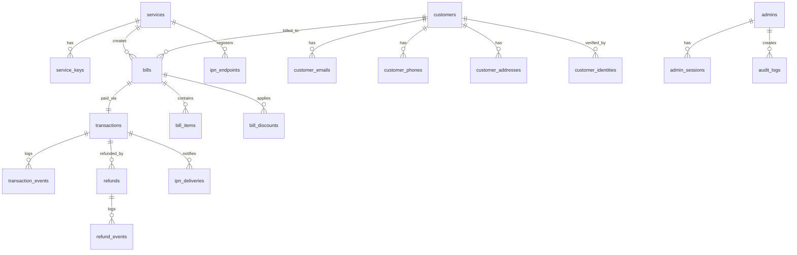

# Trialvo Pay — Centralized Payment Microservice

## Grand Implementation Plan

> A fully containerized, security-first payment platform that serves all projects (Graduate Fashion ecom, BizRadar API subscriptions, Neelamghonta premium tiers, donation platforms, and future services).

---

## Table of Contents

1. [Architecture Overview](#1-architecture-overview)
2. [Tech Stack](#2-tech-stack)
3. [Security Architecture](#3-security-architecture)
4. [Database Schema](#4-database-schema)
5. [API Specifications](#5-api-specifications)
6. [Billing Token Lifecycle](#6-billing-token-lifecycle)
7. [EPS Gateway Integration](#7-eps-gateway-integration)
8. [IPN (Instant Payment Notification)](#8-ipn-instant-payment-notification)
9. [Refund Pipeline](#9-refund-pipeline)
10. [Customer Identity Resolution](#10-customer-identity-resolution)
11. [Admin Panel](#11-admin-panel)
12. [Notification System](#12-notification-system)
13. [CI/CD & Deployment](#13-cicd--deployment)
14. [Directory Structure](#14-directory-structure)
15. [Verification Plan](#15-verification-plan)

---

## 1. Architecture Overview

```
┌──────────────────────────────────────────────────────────────────────────┐
│                         EXTERNAL SERVICES                                │
│                                                                          │
│  ┌──────────────┐  ┌───────────────┐  ┌───────────┐  ┌──────────────┐   │
│  │ Graduate     │  │  BizRadar     │  │ Neelam-   │  │  Future      │   │
│  │ Fashion      │  │  (API Subs)   │  │ ghonta    │  │  Services    │   │
│  │ (Ecom)       │  │               │  │ (Premium) │  │  (Donations) │   │
│  └──────┬───────┘  └───────┬───────┘  └─────┬─────┘  └──────┬───────┘   │
│         │                  │                │               │            │
│         ▼                  ▼                ▼               ▼            │
│  ┌──────────────────────────────────────────────────────────────────┐    │
│  │                    NGINX REVERSE PROXY (TLS)                     │    │
│  │                    Rate Limiting + WAF Rules                     │    │
│  └──────────────────────────┬───────────────────────────────────────┘    │
│                             │                                            │
│  ┌──────────────────────────▼───────────────────────────────────────┐    │
│  │                      TRIALVO_PAY API (Rust/Actix-Web)               │    │
│  │                                                                  │    │
│  │  ┌─────────┐  ┌──────────┐  ┌──────────┐  ┌─────────────────┐   │    │
│  │  │  Auth   │  │ Billing  │  │ Payment  │  │     Admin       │   │    │
│  │  │ Guard   │  │ Engine   │  │ Gateway  │  │     Panel       │   │    │
│  │  │ (HMAC)  │  │ (Tokens) │  │ (EPS)    │  │     (API)       │   │    │
│  │  └─────────┘  └──────────┘  └──────────┘  └─────────────────┘   │    │
│  │  ┌─────────┐  ┌──────────┐  ┌──────────┐  ┌─────────────────┐   │    │
│  │  │ IPN     │  │ Refund   │  │ Customer │  │  Notification   │   │    │
│  │  │ Engine  │  │ Pipeline │  │ Identity │  │     Engine      │   │    │
│  │  └─────────┘  └──────────┘  └──────────┘  └─────────────────┘   │    │
│  └──────────────────────────────────────────────────────────────────┘    │
│              │                    │                    │                  │
│     ┌────────▼─────┐    ┌────────▼─────┐    ┌────────▼────────┐         │
│     │ PostgreSQL   │    │    Redis     │    │   EPS Gateway   │         │
│     │ (Primary DB) │    │  (Cache +   │    │  (External PG)  │         │
│     │              │    │   Queues)    │    │                 │         │
│     └──────────────┘    └──────────────┘    └─────────────────┘         │
└──────────────────────────────────────────────────────────────────────────┘
```

---

## 2. Tech Stack

| Layer | Choice | Rationale |
|---|---|---|
| **Language** | **Rust** (Actix-Web 4) | Max security (memory-safe, no GC pauses), fastest throughput, compile-time guarantees. Zero-cost abstractions for crypto. |
| **Database** | **PostgreSQL 16** | ACID, `pgcrypto` for at-rest encryption, JSONB for flexible metadata, row-level security, excellent indexing. |
| **Cache / Queue** | **Redis 7** | Token caching, rate limiting (sliding window), IPN job queue (Redis Streams), session store. |
| **ORM** | **SQLx** (compile-time checked queries) | Queries verified at compile time against live DB schema. No runtime SQL errors possible. |
| **Admin Panel** | **Embedded SPA** (Vanilla JS + CSS) | Served from the same container. No separate frontend deployment. Premium dark-mode glassmorphic UI. |
| **Container** | **Docker + Docker Compose** | Single `docker-compose.yml` for Postgres, Redis, and Trialvo Pay API. |
| **Reverse Proxy** | **Nginx** | TLS termination, rate limiting, IP allowlisting, request body size limits. |
| **CI/CD** | **GitHub Actions** | Build → Test → Docker push → SSH deploy to VPS. |
| **Crypto** | `ring` + `argon2` | HMAC-SHA256 via `ring`, password hashing via Argon2id (winner of PHC). |

> [!NOTE]
> **Stack confirmed: Rust + Actix-Web 4.** Memory safety at compile time, zero GC pauses, type system eliminates null pointers, data races, and buffer overflows — all critical for a payment service.

---

## 3. Security Architecture

### 3.1 Service Authentication (Client → Trialvo Pay)

Each registered service gets a **key pair**: `service_id` (public) + `secret_key` (private, 64-byte random).

**Every request** from a client service must include:

```
Headers:
  X-Service-Id: svc_graduatefashion
  X-Timestamp: 1719475200
  X-Nonce: a1b2c3d4e5f6
  X-Signature: HMAC-SHA256(secret_key, "{service_id}:{timestamp}:{nonce}:{request_body_sha256}")
```

**Verification algorithm:**

```
1. Extract X-Service-Id, X-Timestamp, X-Nonce, X-Signature
2. Reject if |current_time - timestamp| > 300 seconds (replay window)
3. Reject if nonce seen in Redis within last 600 seconds (replay attack)
4. Lookup secret_key from DB by service_id
5. Compute body_hash = SHA256(raw_request_body)
6. Compute expected = HMAC-SHA256(secret_key, "{service_id}:{timestamp}:{nonce}:{body_hash}")
7. Constant-time compare expected vs X-Signature
8. Store nonce in Redis with 600s TTL
```

### 3.2 Admin Authentication

- **Argon2id** password hashing (memory: 64MB, iterations: 3, parallelism: 4)
- **JWT** with RS256 (RSA 2048-bit) — asymmetric keys stored in DB, rotatable from admin panel
- **TOTP 2FA** (RFC 6238) mandatory for admin accounts
- **Session binding** — JWT includes IP hash and user-agent fingerprint
- **Automatic lockout** after 5 failed attempts (30-min cooldown)

### 3.3 Encryption at Rest

| Data | Method |
|---|---|
| Secret keys (service) | AES-256-GCM encrypted in DB, master key in env |
| EPS credentials | AES-256-GCM encrypted in DB, decrypted in-memory only |
| Customer PII (NID, birth cert) | AES-256-GCM column-level encryption |
| Passwords (admin) | Argon2id one-way hash |

### 3.4 Rate Limiting

| Endpoint Type | Limit | Window |
|---|---|---|
| Service API (per service) | 100 req/s | Sliding window |
| Payment init | 10 req/s per service | Sliding window |
| Admin login | 5 req/min per IP | Fixed window |
| IPN callbacks | 50 req/s global | Sliding window |
| Refund | 5 req/min per service | Fixed window |

### 3.5 Key Rotation

- Admin can **rotate** a service's secret key from the admin panel
- Old key remains valid for a **grace period** (configurable, default 24h)
- Both old and new keys are checked during grace period
- Rotation emits webhook notification to the service's registered callback URL

---

## 4. Database Schema

### 4.1 Entity Relationship Diagram



### 4.2 Full DDL (PostgreSQL)

```sql
-- ═══════════════════════════════════════════════════════════════════
-- Trialvo Pay — Central Payment Service Database Schema
-- PostgreSQL 16 + pgcrypto
-- ═══════════════════════════════════════════════════════════════════

CREATE EXTENSION IF NOT EXISTS "uuid-ossp";
CREATE EXTENSION IF NOT EXISTS "pgcrypto";

-- ─── ENUM TYPES ────────────────────────────────────────────────────

CREATE TYPE bill_status AS ENUM (
    'draft', 'pending', 'processing', 'paid', 'partially_paid',
    'failed', 'expired', 'cancelled', 'refunded', 'partially_refunded'
);

CREATE TYPE transaction_status AS ENUM (
    'initiated', 'pending', 'processing', 'success', 'failed', 'cancelled', 'expired'
);

CREATE TYPE refund_status AS ENUM (
    'requested', 'approved', 'processing', 'completed', 'rejected', 'failed'
);

CREATE TYPE ipn_delivery_status AS ENUM (
    'queued', 'sent', 'delivered', 'failed', 'exhausted'
);

CREATE TYPE payment_type AS ENUM (
    'one_time', 'subscription', 'donation', 'api_subscription', 'invoice'
);

CREATE TYPE identity_type AS ENUM (
    'nid', 'birth_certificate', 'passport', 'driving_license'
);

CREATE TYPE notification_channel AS ENUM ('email', 'sms', 'webhook');

-- ─── 1. REGISTERED SERVICES ───────────────────────────────────────

CREATE TABLE services (
    id              UUID PRIMARY KEY DEFAULT uuid_generate_v4(),
    slug            VARCHAR(50) NOT NULL UNIQUE,           -- e.g. "graduate_fashion"
    display_name    VARCHAR(200) NOT NULL,
    description     TEXT,
    contact_email   VARCHAR(255),
    contact_phone   VARCHAR(20),
    logo_url        VARCHAR(512),
    
    -- Callback URLs
    success_url     VARCHAR(512),                          -- Default payment success redirect
    fail_url        VARCHAR(512),
    cancel_url      VARCHAR(512),
    
    -- Limits
    daily_tx_limit      INTEGER DEFAULT 1000,
    monthly_tx_limit    INTEGER DEFAULT 50000,
    max_single_amount   DECIMAL(14,2) DEFAULT 500000.00,
    min_single_amount   DECIMAL(14,2) DEFAULT 1.00,
    
    -- Status
    is_active       BOOLEAN NOT NULL DEFAULT TRUE,
    is_sandbox      BOOLEAN NOT NULL DEFAULT TRUE,          -- sandbox vs live mode
    
    -- Metadata
    meta            JSONB DEFAULT '{}',
    created_at      TIMESTAMPTZ NOT NULL DEFAULT NOW(),
    updated_at      TIMESTAMPTZ NOT NULL DEFAULT NOW()
);

CREATE INDEX idx_services_slug ON services(slug);
CREATE INDEX idx_services_active ON services(is_active);

-- ─── 2. SERVICE KEYS (with rotation support) ─────────────────────

CREATE TABLE service_keys (
    id              UUID PRIMARY KEY DEFAULT uuid_generate_v4(),
    service_id      UUID NOT NULL REFERENCES services(id) ON DELETE CASCADE,
    
    -- The secret key is AES-256-GCM encrypted; decrypted only in app memory
    key_hash        VARCHAR(128) NOT NULL,                  -- SHA256 of raw key (for lookup)
    encrypted_key   BYTEA NOT NULL,                         -- AES-256-GCM(raw_secret_key)
    key_prefix      VARCHAR(12) NOT NULL,                   -- First 8 chars for identification
    
    -- Rotation
    is_primary      BOOLEAN NOT NULL DEFAULT TRUE,
    grace_until     TIMESTAMPTZ,                            -- Old key valid until this time
    
    -- Status
    is_active       BOOLEAN NOT NULL DEFAULT TRUE,
    revoked_at      TIMESTAMPTZ,
    revoked_reason  TEXT,
    
    created_at      TIMESTAMPTZ NOT NULL DEFAULT NOW(),
    last_used_at    TIMESTAMPTZ,
    
    CONSTRAINT uniq_service_primary UNIQUE (service_id, is_primary)
        -- Partial unique: only one primary key per service
        -- Enforced at application level since partial unique is complex
);

CREATE INDEX idx_service_keys_hash ON service_keys(key_hash);
CREATE INDEX idx_service_keys_service ON service_keys(service_id, is_active);

-- ─── 3. CUSTOMERS (Cross-Service Identity) ───────────────────────

CREATE TABLE customers (
    id              UUID PRIMARY KEY DEFAULT uuid_generate_v4(),
    
    -- Canonical identity
    canonical_name  VARCHAR(300),
    display_name    VARCHAR(300),
    
    -- Fingerprint for deduplication (computed from verified identifiers)
    identity_hash   VARCHAR(128) UNIQUE,                    -- SHA256 of normalized(phone+email+nid)
    
    -- Aggregate stats
    total_spent     DECIMAL(14,2) NOT NULL DEFAULT 0.00,
    total_refunded  DECIMAL(14,2) NOT NULL DEFAULT 0.00,
    transaction_count INTEGER NOT NULL DEFAULT 0,
    
    -- Risk scoring
    risk_score      SMALLINT DEFAULT 0,                     -- 0-100, higher = riskier
    is_blocked      BOOLEAN NOT NULL DEFAULT FALSE,
    block_reason    TEXT,
    
    meta            JSONB DEFAULT '{}',
    first_seen_at   TIMESTAMPTZ NOT NULL DEFAULT NOW(),
    last_seen_at    TIMESTAMPTZ NOT NULL DEFAULT NOW(),
    created_at      TIMESTAMPTZ NOT NULL DEFAULT NOW(),
    updated_at      TIMESTAMPTZ NOT NULL DEFAULT NOW()
);

CREATE INDEX idx_customers_identity_hash ON customers(identity_hash);
CREATE INDEX idx_customers_risk ON customers(risk_score) WHERE risk_score > 50;

-- ─── 4. CUSTOMER CONTACT INFO (Multi-value) ──────────────────────

CREATE TABLE customer_emails (
    id              UUID PRIMARY KEY DEFAULT uuid_generate_v4(),
    customer_id     UUID NOT NULL REFERENCES customers(id) ON DELETE CASCADE,
    email           VARCHAR(255) NOT NULL,
    email_normalized VARCHAR(255) NOT NULL,                 -- lowercase, trimmed
    is_primary      BOOLEAN NOT NULL DEFAULT FALSE,
    is_verified     BOOLEAN NOT NULL DEFAULT FALSE,
    verified_at     TIMESTAMPTZ,
    source_service  UUID REFERENCES services(id),           -- Which service provided this
    created_at      TIMESTAMPTZ NOT NULL DEFAULT NOW()
);

CREATE UNIQUE INDEX idx_customer_emails_unique ON customer_emails(email_normalized);
CREATE INDEX idx_customer_emails_customer ON customer_emails(customer_id);

CREATE TABLE customer_phones (
    id              UUID PRIMARY KEY DEFAULT uuid_generate_v4(),
    customer_id     UUID NOT NULL REFERENCES customers(id) ON DELETE CASCADE,
    phone           VARCHAR(20) NOT NULL,
    phone_normalized VARCHAR(20) NOT NULL,                  -- E.164 format
    is_primary      BOOLEAN NOT NULL DEFAULT FALSE,
    is_verified     BOOLEAN NOT NULL DEFAULT FALSE,
    verified_at     TIMESTAMPTZ,
    source_service  UUID REFERENCES services(id),
    created_at      TIMESTAMPTZ NOT NULL DEFAULT NOW()
);

CREATE UNIQUE INDEX idx_customer_phones_unique ON customer_phones(phone_normalized);
CREATE INDEX idx_customer_phones_customer ON customer_phones(customer_id);

CREATE TABLE customer_addresses (
    id              UUID PRIMARY KEY DEFAULT uuid_generate_v4(),
    customer_id     UUID NOT NULL REFERENCES customers(id) ON DELETE CASCADE,
    label           VARCHAR(50) DEFAULT 'home',             -- home, office, etc.
    full_address    TEXT NOT NULL,
    city            VARCHAR(100),
    state           VARCHAR(100),
    postcode        VARCHAR(20),
    country         VARCHAR(10) DEFAULT 'BD',
    is_primary      BOOLEAN NOT NULL DEFAULT FALSE,
    source_service  UUID REFERENCES services(id),
    created_at      TIMESTAMPTZ NOT NULL DEFAULT NOW()
);

CREATE INDEX idx_customer_addresses_customer ON customer_addresses(customer_id);

-- ─── 5. CUSTOMER IDENTITY DOCUMENTS (Encrypted PII) ──────────────

CREATE TABLE customer_identities (
    id              UUID PRIMARY KEY DEFAULT uuid_generate_v4(),
    customer_id     UUID NOT NULL REFERENCES customers(id) ON DELETE CASCADE,
    identity_type   identity_type NOT NULL,
    
    -- Encrypted storage (AES-256-GCM)
    identity_number_encrypted BYTEA NOT NULL,               -- Encrypted NID/BC number
    identity_hash   VARCHAR(128) NOT NULL,                  -- SHA256 for lookup without decryption
    
    is_verified     BOOLEAN NOT NULL DEFAULT FALSE,
    verified_at     TIMESTAMPTZ,
    verified_by     VARCHAR(100),                           -- "service:graduate_fashion" or "admin:manual"
    
    meta            JSONB DEFAULT '{}',                     -- Extra verified data
    source_service  UUID REFERENCES services(id),
    created_at      TIMESTAMPTZ NOT NULL DEFAULT NOW()
);

CREATE INDEX idx_customer_identities_hash ON customer_identities(identity_hash);
CREATE INDEX idx_customer_identities_customer ON customer_identities(customer_id);

-- ─── 6. BILLS (Billing Token System) ─────────────────────────────

CREATE TABLE bills (
    id              UUID PRIMARY KEY DEFAULT uuid_generate_v4(),
    
    -- Bill token (the public-facing token services/users interact with)
    bill_token      VARCHAR(64) NOT NULL UNIQUE,            -- Cryptographically random, URL-safe
    
    -- Relations
    service_id      UUID NOT NULL REFERENCES services(id),
    customer_id     UUID REFERENCES customers(id),
    
    -- External references from the calling service
    external_order_id       VARCHAR(255),                   -- Graduate Fashion order ID, BizRadar sub ID, etc.
    external_subscription_id VARCHAR(255),
    external_invoice_id     VARCHAR(255),
    
    -- Payment details
    payment_type    payment_type NOT NULL DEFAULT 'one_time',
    currency        VARCHAR(3) NOT NULL DEFAULT 'BDT',
    
    -- Amounts
    subtotal        DECIMAL(14,2) NOT NULL,
    total_discount  DECIMAL(14,2) NOT NULL DEFAULT 0.00,
    tax_amount      DECIMAL(14,2) NOT NULL DEFAULT 0.00,
    shipping_amount DECIMAL(14,2) NOT NULL DEFAULT 0.00,
    final_amount    DECIMAL(14,2) NOT NULL,                 -- What the customer actually pays
    
    -- Customer details (denormalized snapshot at billing time)
    customer_name   VARCHAR(300),
    customer_email  VARCHAR(255),
    customer_phone  VARCHAR(20),
    customer_address TEXT,
    customer_city   VARCHAR(100),
    customer_state  VARCHAR(100),
    customer_postcode VARCHAR(20),
    customer_country VARCHAR(10) DEFAULT 'BD',
    
    -- Shipment details (optional)
    shipment_name   VARCHAR(300),
    shipment_address TEXT,
    shipment_city   VARCHAR(100),
    shipment_state  VARCHAR(100),
    shipment_postcode VARCHAR(20),
    shipment_country VARCHAR(10),
    
    -- Subscription details
    subscription_tier       VARCHAR(100),
    subscription_period     VARCHAR(50),                     -- "monthly", "yearly", etc.
    subscription_cost       DECIMAL(14,2),
    
    -- Status
    status          bill_status NOT NULL DEFAULT 'pending',
    
    -- Expiry (bills expire after configurable TTL)
    expires_at      TIMESTAMPTZ NOT NULL,
    
    -- Callbacks (override service defaults)
    success_url     VARCHAR(512),
    fail_url        VARCHAR(512),
    cancel_url      VARCHAR(512),
    
    -- IP tracking
    client_ip       INET,
    user_agent      TEXT,
    
    -- Metadata (arbitrary JSON from the calling service)
    service_meta    JSONB DEFAULT '{}',                      -- Whatever the service wants to store
    internal_notes  TEXT,
    
    created_at      TIMESTAMPTZ NOT NULL DEFAULT NOW(),
    updated_at      TIMESTAMPTZ NOT NULL DEFAULT NOW(),
    paid_at         TIMESTAMPTZ,
    cancelled_at    TIMESTAMPTZ,
    expired_at      TIMESTAMPTZ
);

CREATE INDEX idx_bills_token ON bills(bill_token);
CREATE INDEX idx_bills_service ON bills(service_id, created_at DESC);
CREATE INDEX idx_bills_customer ON bills(customer_id);
CREATE INDEX idx_bills_status ON bills(status);
CREATE INDEX idx_bills_external_order ON bills(service_id, external_order_id);
CREATE INDEX idx_bills_external_sub ON bills(service_id, external_subscription_id);
CREATE INDEX idx_bills_expires ON bills(expires_at) WHERE status IN ('pending', 'processing');

-- ─── 7. BILL ITEMS (Line Items) ──────────────────────────────────

CREATE TABLE bill_items (
    id              UUID PRIMARY KEY DEFAULT uuid_generate_v4(),
    bill_id         UUID NOT NULL REFERENCES bills(id) ON DELETE CASCADE,
    
    -- Product details
    external_product_id VARCHAR(255),
    product_name    VARCHAR(500) NOT NULL,
    product_category VARCHAR(255),
    product_profile VARCHAR(500),                           -- Image URL or description
    
    -- Pricing
    quantity        INTEGER NOT NULL DEFAULT 1,
    unit_buying_price  DECIMAL(14,2),                       -- Cost price (for analytics)
    unit_selling_price DECIMAL(14,2) NOT NULL,              -- Listed selling price
    unit_discount   DECIMAL(14,2) NOT NULL DEFAULT 0.00,
    unit_final_price DECIMAL(14,2) NOT NULL,                -- After discount
    line_total      DECIMAL(14,2) NOT NULL,                 -- quantity × unit_final_price
    
    -- Metadata
    meta            JSONB DEFAULT '{}',
    serial          SMALLINT NOT NULL DEFAULT 1,
    created_at      TIMESTAMPTZ NOT NULL DEFAULT NOW()
);

CREATE INDEX idx_bill_items_bill ON bill_items(bill_id);

-- ─── 8. BILL DISCOUNTS ───────────────────────────────────────────

CREATE TABLE bill_discounts (
    id              UUID PRIMARY KEY DEFAULT uuid_generate_v4(),
    bill_id         UUID NOT NULL REFERENCES bills(id) ON DELETE CASCADE,
    
    discount_code   VARCHAR(100),
    discount_name   VARCHAR(255) NOT NULL,
    discount_type   SMALLINT NOT NULL DEFAULT 0,            -- 0=flat, 1=percentage
    discount_value  DECIMAL(14,2) NOT NULL,
    discount_amount DECIMAL(14,2) NOT NULL,                 -- Actual BDT saved
    
    applied_scope   VARCHAR(50) DEFAULT 'order',            -- "order", "item", "shipping"
    meta            JSONB DEFAULT '{}',
    created_at      TIMESTAMPTZ NOT NULL DEFAULT NOW()
);

CREATE INDEX idx_bill_discounts_bill ON bill_discounts(bill_id);

-- ─── 9. TRANSACTIONS (EPS Payments) ──────────────────────────────
--
-- Field mapping from EPS API docs (EPS_Payment_Gateway_Documentation.md):
--   eps_merchant_tx_id   ←  InitializeEPS.merchantTransactionId (min 10 digits, unique)
--   eps_transaction_id   ←  InitializeEPS response.TransactionId (UUID from EPS)
--   eps_redirect_url     ←  InitializeEPS response.RedirectURL
--   eps_financial_entity ←  CheckStatus response.FinancialEntity ("OKWallet", "bKash", etc.)
--   eps_customer_id      ←  CheckStatus response.CustomerId (EPS-assigned)
--   eps_payment_ref      ←  CheckStatus response.PaymentReferance (V5 Live only)
--   eps_customer_order_id← InitializeEPS.CustomerOrderId (our external_order_id forwarded)
--   transaction_type_id  ←  InitializeEPS.transactionTypeId (1=Web, 2=Android, 3=iOS)
--   value_a..value_d     ←  InitializeEPS.valueA..valueD (round-trip: bill_token, service_slug)
--

CREATE TABLE transactions (
    id                      UUID PRIMARY KEY DEFAULT uuid_generate_v4(),
    bill_id                 UUID NOT NULL REFERENCES bills(id),
    
    -- EPS-specific fields (maps to InitializeEPS request + response)
    eps_transaction_id      VARCHAR(100),                    -- Response: TransactionId (UUID)
    eps_merchant_tx_id      VARCHAR(100) NOT NULL UNIQUE,   -- Request: merchantTransactionId (≥10 digits, unique)
    eps_customer_order_id   VARCHAR(255),                    -- Request: CustomerOrderId (= bills.external_order_id)
    eps_redirect_url        VARCHAR(512),                    -- Response: RedirectURL
    eps_financial_entity    VARCHAR(100),                    -- Response: FinancialEntity ("OKWallet", "bKash")
    eps_customer_id         VARCHAR(100),                    -- Response: CustomerId (EPS-assigned)
    eps_payment_ref         VARCHAR(255),                    -- Response: PaymentReferance (V5 Live only)
    eps_transaction_date    VARCHAR(100),                    -- Response: TransactionDate ("24 Jun 2024 06:06:19 PM")
    
    -- EPS transaction config
    transaction_type_id     SMALLINT NOT NULL DEFAULT 1,     -- 1=Web, 2=Android, 3=iOS (EPS transactionTypeId)
    
    -- Value slots (round-trip custom values passed through EPS)
    -- valueA = bill_token (for callback identification)
    -- valueB = service_slug (for service identification)
    -- valueC, valueD = reserved for future use
    value_a                 VARCHAR(255),
    value_b                 VARCHAR(255),
    value_c                 VARCHAR(255),
    value_d                 VARCHAR(255),
    
    -- Amount
    amount                  DECIMAL(14,2) NOT NULL,
    currency                VARCHAR(3) NOT NULL DEFAULT 'BDT',
    
    -- Status
    status                  transaction_status NOT NULL DEFAULT 'initiated',
    
    -- Gateway details
    gateway_provider        VARCHAR(50) NOT NULL DEFAULT 'eps',
    gateway_response_raw    JSONB,                          -- Full raw response from EPS (both Init + CheckStatus)
    gateway_error_code      VARCHAR(50),                    -- EPS ErrorCode
    gateway_error_message   TEXT,                           -- EPS ErrorMessage
    
    -- Tracking
    client_ip               INET,                           -- Forwarded as InitializeEPS.ipAddress
    user_agent              TEXT,
    
    -- Timestamps
    initiated_at            TIMESTAMPTZ NOT NULL DEFAULT NOW(),
    redirected_at           TIMESTAMPTZ,                    -- When customer was sent to EPS RedirectURL
    callback_received_at    TIMESTAMPTZ,                    -- When EPS redirected back to our callback
    verified_at             TIMESTAMPTZ,                    -- When CheckStatus confirmed the payment
    completed_at            TIMESTAMPTZ,
    failed_at               TIMESTAMPTZ,
    
    created_at              TIMESTAMPTZ NOT NULL DEFAULT NOW(),
    updated_at              TIMESTAMPTZ NOT NULL DEFAULT NOW()
);

CREATE INDEX idx_transactions_bill ON transactions(bill_id);
CREATE INDEX idx_transactions_eps_tx ON transactions(eps_transaction_id);
CREATE INDEX idx_transactions_eps_merchant ON transactions(eps_merchant_tx_id);
CREATE INDEX idx_transactions_status ON transactions(status);
CREATE INDEX idx_transactions_created ON transactions(created_at DESC);
CREATE INDEX idx_transactions_value_a ON transactions(value_a);  -- For callback lookup by bill_token

-- ─── 10. TRANSACTION EVENTS (Audit Trail) ─────────────────────────

CREATE TABLE transaction_events (
    id              BIGSERIAL PRIMARY KEY,
    transaction_id  UUID NOT NULL REFERENCES transactions(id) ON DELETE CASCADE,
    
    event_type      VARCHAR(50) NOT NULL,                   -- "initiated", "redirected", "callback_received", etc.
    old_status      transaction_status,
    new_status      transaction_status,
    
    event_data      JSONB DEFAULT '{}',
    source          VARCHAR(50) DEFAULT 'system',           -- "system", "eps_callback", "admin", "service"
    source_ip       INET,
    
    created_at      TIMESTAMPTZ NOT NULL DEFAULT NOW()
);

CREATE INDEX idx_tx_events_transaction ON transaction_events(transaction_id, created_at);

-- ─── 11. REFUNDS ──────────────────────────────────────────────────

CREATE TABLE refunds (
    id                  UUID PRIMARY KEY DEFAULT uuid_generate_v4(),
    transaction_id      UUID NOT NULL REFERENCES transactions(id),
    bill_id             UUID NOT NULL REFERENCES bills(id),
    service_id          UUID NOT NULL REFERENCES services(id),
    
    -- Refund details
    refund_amount       DECIMAL(14,2) NOT NULL,
    refund_reason       TEXT NOT NULL,
    refund_type         VARCHAR(50) DEFAULT 'full',         -- "full", "partial"
    
    -- External references for lookup
    external_order_id   VARCHAR(255),
    external_ref        VARCHAR(255),
    
    -- Status
    status              refund_status NOT NULL DEFAULT 'requested',
    
    -- Processing
    requested_by        VARCHAR(100) NOT NULL,              -- "service:slug" or "admin:email"
    approved_by         UUID REFERENCES admins(id),
    processed_by        VARCHAR(100),
    
    rejection_reason    TEXT,
    
    -- Gateway
    gateway_refund_ref  VARCHAR(255),
    gateway_response    JSONB,
    
    -- Timestamps
    requested_at        TIMESTAMPTZ NOT NULL DEFAULT NOW(),
    approved_at         TIMESTAMPTZ,
    processed_at        TIMESTAMPTZ,
    completed_at        TIMESTAMPTZ,
    rejected_at         TIMESTAMPTZ,
    
    created_at          TIMESTAMPTZ NOT NULL DEFAULT NOW(),
    updated_at          TIMESTAMPTZ NOT NULL DEFAULT NOW()
);

CREATE INDEX idx_refunds_transaction ON refunds(transaction_id);
CREATE INDEX idx_refunds_bill ON refunds(bill_id);
CREATE INDEX idx_refunds_service ON refunds(service_id, created_at DESC);
CREATE INDEX idx_refunds_status ON refunds(status);

-- ─── 12. REFUND EVENTS ───────────────────────────────────────────

CREATE TABLE refund_events (
    id              BIGSERIAL PRIMARY KEY,
    refund_id       UUID NOT NULL REFERENCES refunds(id) ON DELETE CASCADE,
    
    event_type      VARCHAR(50) NOT NULL,
    old_status      refund_status,
    new_status      refund_status,
    
    event_data      JSONB DEFAULT '{}',
    actor           VARCHAR(100),                           -- Who triggered this event
    
    created_at      TIMESTAMPTZ NOT NULL DEFAULT NOW()
);

CREATE INDEX idx_refund_events_refund ON refund_events(refund_id, created_at);

-- ─── 13. IPN ENDPOINTS ───────────────────────────────────────────

CREATE TABLE ipn_endpoints (
    id              UUID PRIMARY KEY DEFAULT uuid_generate_v4(),
    service_id      UUID NOT NULL REFERENCES services(id) ON DELETE CASCADE,
    
    url             VARCHAR(512) NOT NULL,
    secret          VARCHAR(128) NOT NULL,                  -- For HMAC signing IPN payloads
    
    -- Event subscriptions
    events          TEXT[] NOT NULL DEFAULT '{payment.success,payment.failed,refund.completed}',
    
    -- Health
    is_active       BOOLEAN NOT NULL DEFAULT TRUE,
    failure_count   INTEGER NOT NULL DEFAULT 0,
    last_success_at TIMESTAMPTZ,
    last_failure_at TIMESTAMPTZ,
    
    created_at      TIMESTAMPTZ NOT NULL DEFAULT NOW(),
    updated_at      TIMESTAMPTZ NOT NULL DEFAULT NOW()
);

CREATE INDEX idx_ipn_endpoints_service ON ipn_endpoints(service_id, is_active);

-- ─── 14. IPN DELIVERIES ──────────────────────────────────────────

CREATE TABLE ipn_deliveries (
    id              BIGSERIAL PRIMARY KEY,
    ipn_endpoint_id UUID NOT NULL REFERENCES ipn_endpoints(id) ON DELETE CASCADE,
    transaction_id  UUID REFERENCES transactions(id),
    refund_id       UUID REFERENCES refunds(id),
    bill_id         UUID REFERENCES bills(id),
    
    event_type      VARCHAR(50) NOT NULL,
    payload         JSONB NOT NULL,
    signature       VARCHAR(128) NOT NULL,                  -- HMAC of payload
    
    -- Delivery tracking
    status          ipn_delivery_status NOT NULL DEFAULT 'queued',
    attempt_count   SMALLINT NOT NULL DEFAULT 0,
    max_attempts    SMALLINT NOT NULL DEFAULT 5,
    
    -- Response
    http_status     SMALLINT,
    response_body   TEXT,
    error_message   TEXT,
    
    -- Timing
    next_retry_at   TIMESTAMPTZ,
    first_sent_at   TIMESTAMPTZ,
    last_sent_at    TIMESTAMPTZ,
    delivered_at    TIMESTAMPTZ,
    
    created_at      TIMESTAMPTZ NOT NULL DEFAULT NOW()
);

CREATE INDEX idx_ipn_deliveries_status ON ipn_deliveries(status, next_retry_at)
    WHERE status IN ('queued', 'failed');
CREATE INDEX idx_ipn_deliveries_tx ON ipn_deliveries(transaction_id);
CREATE INDEX idx_ipn_deliveries_endpoint ON ipn_deliveries(ipn_endpoint_id);

-- ─── 15. ADMINS ──────────────────────────────────────────────────

CREATE TABLE admins (
    id              UUID PRIMARY KEY DEFAULT uuid_generate_v4(),
    email           VARCHAR(255) NOT NULL UNIQUE,
    password_hash   VARCHAR(255) NOT NULL,                  -- Argon2id
    
    display_name    VARCHAR(200),
    role            VARCHAR(50) NOT NULL DEFAULT 'viewer',  -- "super_admin", "admin", "viewer"
    
    -- 2FA
    totp_secret_encrypted BYTEA,
    is_2fa_enabled  BOOLEAN NOT NULL DEFAULT FALSE,
    
    -- Security
    failed_login_count SMALLINT NOT NULL DEFAULT 0,
    locked_until    TIMESTAMPTZ,
    last_login_at   TIMESTAMPTZ,
    last_login_ip   INET,
    
    is_active       BOOLEAN NOT NULL DEFAULT TRUE,
    created_at      TIMESTAMPTZ NOT NULL DEFAULT NOW(),
    updated_at      TIMESTAMPTZ NOT NULL DEFAULT NOW()
);

-- ─── 16. ADMIN SESSIONS ─────────────────────────────────────────

CREATE TABLE admin_sessions (
    id              UUID PRIMARY KEY DEFAULT uuid_generate_v4(),
    admin_id        UUID NOT NULL REFERENCES admins(id) ON DELETE CASCADE,
    
    token_hash      VARCHAR(128) NOT NULL UNIQUE,
    ip_address      INET,
    user_agent      TEXT,
    
    expires_at      TIMESTAMPTZ NOT NULL,
    revoked_at      TIMESTAMPTZ,
    
    created_at      TIMESTAMPTZ NOT NULL DEFAULT NOW()
);

CREATE INDEX idx_admin_sessions_token ON admin_sessions(token_hash);
CREATE INDEX idx_admin_sessions_admin ON admin_sessions(admin_id);

-- ─── 17. AUDIT LOGS ─────────────────────────────────────────────

CREATE TABLE audit_logs (
    id              BIGSERIAL PRIMARY KEY,
    
    actor_type      VARCHAR(20) NOT NULL,                   -- "admin", "service", "system", "customer"
    actor_id        VARCHAR(100),
    
    action          VARCHAR(100) NOT NULL,                  -- "service.create", "key.rotate", "refund.approve"
    resource_type   VARCHAR(50),
    resource_id     VARCHAR(100),
    
    old_values      JSONB,
    new_values      JSONB,
    
    ip_address      INET,
    user_agent      TEXT,
    
    created_at      TIMESTAMPTZ NOT NULL DEFAULT NOW()
);

CREATE INDEX idx_audit_logs_actor ON audit_logs(actor_type, actor_id, created_at DESC);
CREATE INDEX idx_audit_logs_action ON audit_logs(action, created_at DESC);
CREATE INDEX idx_audit_logs_resource ON audit_logs(resource_type, resource_id);
CREATE INDEX idx_audit_logs_created ON audit_logs(created_at DESC);

-- ─── 18. SYSTEM CONFIG (Admin-Editable KV Store) ─────────────────

CREATE TABLE system_config (
    id              SERIAL PRIMARY KEY,
    category        VARCHAR(50) NOT NULL,                   -- "eps", "smtp", "sms", "general", "security"
    key_name        VARCHAR(100) NOT NULL,
    value           TEXT NOT NULL,
    value_type      VARCHAR(20) NOT NULL DEFAULT 'string',  -- "string", "integer", "boolean", "json", "encrypted"
    description     TEXT,
    is_secret       BOOLEAN NOT NULL DEFAULT FALSE,         -- If true, value is AES-encrypted
    is_active       BOOLEAN NOT NULL DEFAULT TRUE,
    updated_by      UUID REFERENCES admins(id),
    created_at      TIMESTAMPTZ NOT NULL DEFAULT NOW(),
    updated_at      TIMESTAMPTZ NOT NULL DEFAULT NOW(),
    
    UNIQUE(category, key_name)
);

CREATE INDEX idx_system_config_category ON system_config(category, is_active);

-- Seed essential config
INSERT INTO system_config (category, key_name, value, value_type, description, is_secret) VALUES
    -- EPS Gateway (sandbox)
    ('eps', 'sandbox_base_url', 'https://sandboxpgapi.eps.com.bd/v1', 'string', 'EPS Sandbox API base URL', FALSE),
    ('eps', 'sandbox_merchant_id', '29e86e70-0ac6-45eb-ba04-9fcb0aaed12a', 'string', 'Sandbox Merchant ID', FALSE),
    ('eps', 'sandbox_store_id', 'd44e705f-9e3a-41de-98b1-1674631637da', 'string', 'Sandbox Store ID', FALSE),
    ('eps', 'sandbox_username', '', 'encrypted', 'Sandbox login email', TRUE),
    ('eps', 'sandbox_password', '', 'encrypted', 'Sandbox login password', TRUE),
    ('eps', 'sandbox_hash_key', '', 'encrypted', 'Sandbox HMAC hash key', TRUE),
    -- EPS Gateway (live)
    ('eps', 'live_base_url', 'https://pgapi.eps.com.bd/v1', 'string', 'EPS Live API base URL', FALSE),
    ('eps', 'live_merchant_id', '0f71ad2d-2cfe-4b32-8804-918db808cd6f', 'string', 'Live Merchant ID', FALSE),
    ('eps', 'live_store_id', 'b3a6ac12-f3be-4d5f-b0d0-c59e322436d5', 'string', 'Live Store ID', FALSE),
    ('eps', 'live_username', '', 'encrypted', 'Live login email', TRUE),
    ('eps', 'live_password', '', 'encrypted', 'Live login password', TRUE),
    ('eps', 'live_hash_key', '', 'encrypted', 'Live HMAC hash key', TRUE),
    -- EPS Mode
    ('eps', 'mode', 'sandbox', 'string', 'Active mode: sandbox or live', FALSE),
    -- General
    ('general', 'base_url', 'https://pay.trialvo.com', 'string', 'Trialvo Pay public base URL', FALSE),
    ('general', 'domain', 'pay.trialvo.com', 'string', 'Trialvo Pay domain name', FALSE),
    ('general', 'bill_expiry_minutes', '30', 'integer', 'Bill token expiry in minutes', FALSE),
    ('general', 'max_refund_days', '30', 'integer', 'Max days after payment to allow refund', FALSE),
    ('general', 'refund_auto_approve', 'false', 'boolean', 'All refunds require manual admin approval', FALSE),
    ('general', 'default_currency', 'BDT', 'string', 'Default currency code', FALSE),
    -- SMTP
    ('smtp', 'host', '', 'string', 'SMTP host', FALSE),
    ('smtp', 'port', '587', 'integer', 'SMTP port', FALSE),
    ('smtp', 'username', '', 'encrypted', 'SMTP username', TRUE),
    ('smtp', 'password', '', 'encrypted', 'SMTP password', TRUE),
    ('smtp', 'from_email', 'noreply@pay.trialvo.com', 'string', 'From email address', FALSE),
    ('smtp', 'from_name', 'Trialvo Pay', 'string', 'From display name', FALSE),
    -- SMS
    ('sms', 'provider', 'bulksms', 'string', 'SMS provider name', FALSE),
    ('sms', 'api_key', '', 'encrypted', 'SMS API key', TRUE),
    ('sms', 'api_secret', '', 'encrypted', 'SMS API secret', TRUE),
    ('sms', 'sender_id', 'Trialvo Pay', 'string', 'SMS sender ID', FALSE),
    -- Security
    ('security', 'replay_window_seconds', '300', 'integer', 'Max age of request timestamp', FALSE),
    ('security', 'nonce_ttl_seconds', '600', 'integer', 'How long to remember nonces', FALSE),
    ('security', 'admin_session_hours', '8', 'integer', 'Admin session duration', FALSE),
    ('security', 'max_login_attempts', '5', 'integer', 'Max failed logins before lockout', FALSE),
    ('security', 'lockout_minutes', '30', 'integer', 'Lockout duration in minutes', FALSE);

-- ─── 19. NOTIFICATION LOG ────────────────────────────────────────

CREATE TABLE notification_log (
    id              BIGSERIAL PRIMARY KEY,
    
    channel         notification_channel NOT NULL,
    recipient       VARCHAR(255) NOT NULL,                  -- Email/phone
    subject         VARCHAR(500),
    body            TEXT,
    
    -- Context
    related_bill_id     UUID REFERENCES bills(id),
    related_transaction_id UUID REFERENCES transactions(id),
    related_refund_id   UUID REFERENCES refunds(id),
    
    -- Delivery
    provider        VARCHAR(50),
    provider_msg_id VARCHAR(255),
    status          VARCHAR(20) NOT NULL DEFAULT 'sent',
    error_message   TEXT,
    
    created_at      TIMESTAMPTZ NOT NULL DEFAULT NOW()
);

CREATE INDEX idx_notification_log_recipient ON notification_log(recipient, created_at DESC);
CREATE INDEX idx_notification_log_bill ON notification_log(related_bill_id);

-- ─── 20. NONCE STORE (Redis-backed, but DB fallback) ─────────────
-- Primary nonce storage is Redis. This table is for audit only.

CREATE TABLE used_nonces (
    nonce           VARCHAR(64) PRIMARY KEY,
    service_id      UUID NOT NULL,
    used_at         TIMESTAMPTZ NOT NULL DEFAULT NOW()
);

-- Partition by time for efficient cleanup
CREATE INDEX idx_used_nonces_time ON used_nonces(used_at);

-- ─── FUNCTIONS ───────────────────────────────────────────────────

-- Auto-update updated_at
CREATE OR REPLACE FUNCTION update_updated_at()
RETURNS TRIGGER AS $$
BEGIN
    NEW.updated_at = NOW();
    RETURN NEW;
END;
$$ LANGUAGE plpgsql;

-- Apply to all tables with updated_at
CREATE TRIGGER trg_services_updated BEFORE UPDATE ON services FOR EACH ROW EXECUTE FUNCTION update_updated_at();
CREATE TRIGGER trg_bills_updated BEFORE UPDATE ON bills FOR EACH ROW EXECUTE FUNCTION update_updated_at();
CREATE TRIGGER trg_transactions_updated BEFORE UPDATE ON transactions FOR EACH ROW EXECUTE FUNCTION update_updated_at();
CREATE TRIGGER trg_refunds_updated BEFORE UPDATE ON refunds FOR EACH ROW EXECUTE FUNCTION update_updated_at();
CREATE TRIGGER trg_customers_updated BEFORE UPDATE ON customers FOR EACH ROW EXECUTE FUNCTION update_updated_at();
CREATE TRIGGER trg_admins_updated BEFORE UPDATE ON admins FOR EACH ROW EXECUTE FUNCTION update_updated_at();
CREATE TRIGGER trg_system_config_updated BEFORE UPDATE ON system_config FOR EACH ROW EXECUTE FUNCTION update_updated_at();

-- Auto-expire bills
CREATE OR REPLACE FUNCTION expire_stale_bills() RETURNS void AS $$
BEGIN
    UPDATE bills SET status = 'expired', expired_at = NOW(), updated_at = NOW()
    WHERE status IN ('pending', 'processing') AND expires_at < NOW();
END;
$$ LANGUAGE plpgsql;
```

---

## 5. API Specifications

### 5.1 Service-Facing API (requires HMAC auth)

| Method | Endpoint | Description |
|---|---|---|
| POST | `/api/v1/bills` | Create a bill, get billing token |
| GET | `/api/v1/bills/{bill_token}` | Get bill details + status |
| POST | `/api/v1/bills/{bill_token}/cancel` | Cancel a pending bill |
| POST | `/api/v1/refunds` | Request a refund |
| GET | `/api/v1/refunds/{refund_id}` | Check refund status |
| GET | `/api/v1/transactions/{tx_id}` | Get transaction details |
| GET | `/api/v1/customers/{customer_id}` | Get customer payment history |

### 5.2 Customer-Facing API (requires bill token)

| Method | Endpoint | Description |
|---|---|---|
| GET | `/pay/{bill_token}` | Payment page (renders bill + pay button) |
| POST | `/pay/{bill_token}/initiate` | Start EPS payment flow |
| GET | `/pay/{bill_token}/status` | Check payment status |
| GET | `/pay/callback` | EPS redirect callback (success/fail/cancel) |

### 5.3 Admin API (requires admin JWT + 2FA)

| Method | Endpoint | Description |
|---|---|---|
| POST | `/admin/auth/login` | Admin login |
| POST | `/admin/auth/2fa` | 2FA verification |
| GET | `/admin/dashboard` | Dashboard stats |
| CRUD | `/admin/services` | Manage registered services |
| CRUD | `/admin/services/{id}/keys` | Manage service keys |
| GET | `/admin/transactions` | List/filter transactions |
| GET | `/admin/bills` | List/filter bills |
| GET | `/admin/refunds` | List/filter refunds |
| POST | `/admin/refunds/{id}/approve` | Approve refund |
| POST | `/admin/refunds/{id}/reject` | Reject refund |
| GET | `/admin/customers` | List/search customers |
| CRUD | `/admin/config` | System configuration KV store |
| GET | `/admin/audit-logs` | View audit trail |
| GET | `/admin/ipn-health` | IPN endpoint health dashboard |

---

## 6. Billing Token Lifecycle

```
┌─────────────────────────────────────────────────────────────────┐
│                   BILLING TOKEN LIFECYCLE                        │
└─────────────────────────────────────────────────────────────────┘

1. SERVICE creates bill
   POST /api/v1/bills  ─────────►  Trialvo Pay generates bill_token
                                    Status: PENDING
                                    Expires: NOW + 30min (configurable)

2. SERVICE receives bill_token
   ◄──── { bill_token: "pvb_a1b2c3d4..." }

3. SERVICE redirects customer to Trialvo Pay
   Customer browser ──► GET /pay/pvb_a1b2c3d4...
                         Trialvo Pay renders payment page

4. Customer clicks "Pay"
   POST /pay/pvb_a1b2c3d4.../initiate
   Trialvo Pay calls EPS InitializeEPS
   Status: PROCESSING

5. Customer redirected to EPS
   Customer ──► EPS Payment Page ──► Completes payment

6. EPS redirects back
   Customer ──► GET /pay/callback?...
   Trialvo Pay calls EPS CheckMerchantTransactionStatus
   Status: PAID ✓

7. Trialvo Pay fires IPN to service
   POST {service.ipn_url}
   Body: { event: "payment.success", bill_token: "...", transaction: {...} }
   Signed: HMAC-SHA256(ipn_secret, payload)

8. Service confirms receipt
   HTTP 200 ◄── Service
   IPN Status: DELIVERED ✓

9. Bill expires (if unpaid)
   CRON: Every 60s, mark expired bills
   Status: EXPIRED
   IPN: { event: "payment.expired" }
```

---

## 7. EPS Gateway Integration

> This section maps 1:1 to [EPS_Payment_Gateway_Documentation.md](file:///d:/payment-service/EPS_Payment_Gateway_Documentation.md)

### 7.1 Module: `gateway/eps.rs`

```rust
// All functions map to EPS API endpoints from the integration guide
pub struct EpsGateway {
    config: EpsConfig,      // Loaded from system_config table
    http: reqwest::Client,
    redis: redis::Client,
}

impl EpsGateway {
    /// EPS API #1: Auth/GetToken
    /// Ref: EPS Doc Section 4
    /// Hash: HMAC-SHA512(hash_key, userName) → Base64
    /// Caches token in Redis with TTL = (expireDate - NOW - 5min)
    /// Auto-refreshes when TTL < 60 seconds
    pub async fn get_token(&self) -> Result<String>

    /// EPS API #2: EPSEngine/InitializeEPS
    /// Ref: EPS Doc Section 5
    /// Hash: HMAC-SHA512(hash_key, merchantTransactionId) → Base64
    /// Maps bill + bill_items → full EPS request body (all 34 params)
    pub async fn initialize_payment(&self, bill: &Bill, items: &[BillItem]) -> Result<InitResponse>

    /// EPS API #3: EPSEngine/CheckMerchantTransactionStatus
    /// Ref: EPS Doc Section 6
    /// Hash: HMAC-SHA512(hash_key, merchantTransactionId) → Base64
    /// V5 Live also supports lookup by EPSTransactionId
    pub async fn check_status(&self, merchant_tx_id: &str) -> Result<StatusResponse>

    /// Generate x-hash header value
    /// Ref: EPS Doc Section 2
    /// Step 1: UTF-8 encode hash_key
    /// Step 2: HMAC-SHA512(key_bytes, data_bytes)
    /// Step 3: Base64 encode result
    fn compute_x_hash(&self, data: &str) -> String
}
```

### 7.2 EPS Field Mapping (Bill → InitializeEPS Request)

| EPS Request Field | Source in Trialvo Pay | Notes |
|---|---|---|
| `merchantId` | `system_config('eps', '{mode}_merchant_id')` | From admin panel |
| `storeId` | `system_config('eps', '{mode}_store_id')` | From admin panel |
| `CustomerOrderId` | `bills.external_order_id` | Passed through by calling service |
| `merchantTransactionId` | Generated: `{timestamp_ms}{random_6_digits}` | ≥10 digits, unique, stored as `transactions.eps_merchant_tx_id` |
| `transactionTypeId` | `1` (Web) / `2` (Android) / `3` (iOS) | Derived from bill request metadata |
| `financialEntityId` | `0` (default) | Let customer choose on EPS page |
| `transitionStatusId` | `0` (default) | Standard flow |
| `totalAmount` | `bills.final_amount` | Already computed by calling service |
| `ipAddress` | `bills.client_ip` | Forwarded from customer request |
| `version` | `"1"` | Hardcoded per EPS docs |
| `successUrl` | `{trialvo_pay_base}/pay/callback?type=success` | Trialvo Pay's own callback, NOT the service's |
| `failUrl` | `{trialvo_pay_base}/pay/callback?type=fail` | Trialvo Pay's own callback |
| `cancelUrl` | `{trialvo_pay_base}/pay/callback?type=cancel` | Trialvo Pay's own callback |
| `customerName` | `bills.customer_name` | **Mandatory** |
| `customerEmail` | `bills.customer_email` | **Mandatory** |
| `customerAddress` | `bills.customer_address` | **Mandatory** |
| `customerCity` | `bills.customer_city` | **Mandatory** |
| `customerState` | `bills.customer_state` | **Mandatory** |
| `customerPostcode` | `bills.customer_postcode` | **Mandatory** |
| `customerCountry` | `bills.customer_country` | Default `"BD"` |
| `customerPhone` | `bills.customer_phone` | **Mandatory** |
| `shipmentName` | `bills.shipment_name` | Optional |
| `shipmentAddress` | `bills.shipment_address` | Optional |
| `shipmentCity` | `bills.shipment_city` | Optional |
| `shipmentState` | `bills.shipment_state` | Optional |
| `shipmentPostcode` | `bills.shipment_postcode` | Optional |
| `shipmentCountry` | `bills.shipment_country` | Optional |
| `valueA` | `bills.bill_token` | **Critical:** Round-trip identifier for callback |
| `valueB` | `services.slug` | Identify which service owns this payment |
| `valueC` | `bills.external_order_id` | Service's order ID for traceability |
| `valueD` | Reserved | Future use |
| `productName` | `bill_items[0].product_name` | Primary product |
| `productProfile` | `bill_items[0].product_profile` | Product image/profile |
| `productCategory` | `bill_items[0].product_category` | Product category |
| `noOfItem` | `SUM(bill_items.quantity)` | Total items |
| `ProductList` | All `bill_items` mapped to EPS format | See below |

### 7.3 ProductList Mapping (bill_items → EPS ProductList)

```json
// For each bill_item:
{
  "ProductName": bill_item.product_name,
  "NoOfItem": bill_item.quantity.to_string(),
  "ProductProfile": bill_item.product_profile || "",
  "ProductCategory": bill_item.product_category || "",
  "ProductPrice": bill_item.unit_final_price.to_string()
}
```

### 7.4 Callback Handling (EPS → Trialvo Pay)

EPS redirects the customer browser back to our callback URLs with **transaction data in the query string**:

```
GET /pay/callback?type=success&TransactionId=xxx&MerchantTransactionId=yyy&...
```

**Trialvo Pay callback handler (`api/payment/callback.rs`):**

```
1. Parse query params: TransactionId, MerchantTransactionId, etc.
2. Lookup transaction by eps_merchant_tx_id
3. Server-side verify: call EPS CheckMerchantTransactionStatus
4. Compare amounts: EPS TotalAmount must match bills.final_amount
5. Store full EPS response in transactions.gateway_response_raw
6. Extract and store:
   - eps_financial_entity  ← response.FinancialEntity
   - eps_customer_id       ← response.CustomerId
   - eps_payment_ref       ← response.PaymentReferance (V5 only)
   - eps_transaction_date  ← response.TransactionDate
7. Update transaction status: success/failed
8. Update bill status: paid/failed
9. Update customer.total_spent (if success)
10. Fire IPN to service
11. Redirect customer to service's success_url/fail_url
    (from bills.success_url or services.success_url fallback)
```

### 7.5 Sandbox vs Live Mode

| Aspect | How It Works |
|---|---|
| **Toggle** | `system_config('eps', 'mode')` = `'sandbox'` or `'live'` — editable from admin panel |
| **Credential selection** | Code reads `{mode}_merchant_id`, `{mode}_store_id`, etc. from system_config |
| **Per-service override** | `services.is_sandbox` flag — a service can be forced to sandbox even when global mode is live |
| **V4 vs V5 differences** | When mode=live: also store `EpsTransactionId` from response, support `PaymentReferance` field |
| **Base URL** | sandbox: `sandboxpgapi.eps.com.bd/v1` / live: `pgapi.eps.com.bd/v1` |

### 7.6 Token Caching Strategy

```
Redis key: "eps:token:{mode}"   (e.g., "eps:token:sandbox")
Redis TTL: (expireDate - NOW - 5min)  — refresh 5 minutes before expiry

On get_token():
  1. Check Redis for cached token
  2. If exists and TTL > 60s → return cached
  3. If missing or TTL ≤ 60s → call EPS GetToken API
  4. Parse expireDate from response
  5. Cache new token in Redis with computed TTL
  6. Return token
```

### 7.7 EPS Branding

EPS provides footer/checkout branding assets ("Pay with EPS" buttons, footer badges in dark/light themes). Located at:
`Trialvo 12/Trialvo/Trialvo/EPS-PGW_Footer_Merchant_Website/`

These will be served from the admin-ui static assets and embedded on the payment page.

---

## 8. IPN (Instant Payment Notification)

### Delivery Strategy

1. **Immediate attempt** on payment status change
2. **Exponential backoff** on failure: 30s → 2min → 8min → 30min → 2h
3. **Max 5 attempts** (configurable per endpoint)
4. **Auto-disable** endpoint after 10 consecutive failures across any events
5. **Manual retry** from admin panel

### IPN Payload (signed)

```json
{
  "event": "payment.success",
  "timestamp": "2026-06-21T08:30:00Z",
  "bill_token": "pvb_a1b2c3d4...",
  "bill": {
    "external_order_id": "GF-ORD-12345",
    "final_amount": 1500.00,
    "currency": "BDT",
    "status": "paid"
  },
  "transaction": {
    "id": "uuid...",
    "eps_transaction_id": "C254919...",
    "financial_entity": "OKWallet",
    "amount": 1500.00,
    "completed_at": "2026-06-21T08:29:55Z"
  },
  "customer": {
    "name": "Shariful Islam",
    "email": "example@gmail.com",
    "phone": "01912610899"
  }
}
```

**Signature:** `X-Trialvo-Pay-Signature: HMAC-SHA256(ipn_endpoint.secret, raw_json_body)`

---

## 9. Refund Pipeline

> [!IMPORTANT]
> **All refunds require manual admin approval.** No auto-approve threshold — every refund request goes through the admin panel for review.

```
Service/Admin                Trialvo Pay                      EPS (if applicable)
     │                          │                               │
     │ POST /api/v1/refunds     │                               │
     │ ─────────────────────►   │                               │
     │                          │ Validate:                     │
     │                          │  - Bill exists & paid         │
     │                          │  - Amount ≤ remaining         │
     │                          │  - Within refund window       │
     │                          │  - Not duplicate              │
     │                          │                               │
     │                          │ Status: REQUESTED             │
     │                          │ Admin notification sent       │
     │ ◄─────── refund_id ──── │                               │
     │                          │                               │
     │    [Admin reviews in      │                               │
     │     admin panel — ALL     │                               │
     │     refunds require       │                               │
     │     manual approval]      │                               │
     │                          │                               │
     │                          │ POST /admin/refunds/{id}/approve
     │                          │ Status: APPROVED              │
     │                          │                               │
     │                          │ Process refund:               │
     │                          │ Update bill → refunded/partial│
     │                          │ Update customer.total_refunded│
     │                          │ Status: COMPLETED             │
     │                          │                               │
     │                          │ Fire IPN:                     │
     │                          │ event: refund.completed       │
     │ ◄────── IPN ──────────  │                               │
```

**Refund lookup supports:** `bill_token`, `external_order_id`, `external_subscription_id`, `transaction_id`

**Admin refund queue features:**
- Pending refund count badge on sidebar (`rotate-ccw` icon with red dot)
- Refund detail view: original bill, transaction, customer history, reason
- One-click approve (`check-circle`) or reject (`x-circle`) with mandatory rejection reason
- Email notification to admin on new refund request
- Email notification to service contact on approval/rejection

---

## 10. Customer Identity Resolution

**Uniqueness strategy** — resolve a single person across services:

1. **Primary match:** Normalized phone number (E.164 format)
2. **Secondary match:** Normalized email (lowercase, trimmed)
3. **Tertiary match:** NID hash or birth certificate hash

**Algorithm:**

```
On new bill creation:
  1. Normalize phone → E.164 (e.g., "01912610899" → "+8801912610899")
  2. Normalize email → lowercase, trim
  3. Check customer_phones for phone match → found? Link to existing customer
  4. If no phone match, check customer_emails for email match → found? Link
  5. If no match at all → create new customer
  6. If phone matches one customer but email matches another → merge (keep lower-id customer)
  7. Compute identity_hash = SHA256(sorted(all_verified_phones + all_verified_emails + nid))
```

---

## 11. Admin Panel & UI/UX

### 11.1 UI Architecture

- **Embedded SPA** served from `/admin/` path on the same server
- **No external JS frameworks** — vanilla JS + CSS custom properties
- **Real-time updates** via WebSocket (new transactions, IPN failures, refund requests)

### 11.2 Design System

#### Icons
- **Lucide Icons** (CDN: `unpkg.com/lucide@latest`) — clean, consistent, 24×24 SVG icon set
- Every action, nav item, and status indicator uses a Lucide icon — **no raw text symbols** (✓ ✗ ▲) or emoji

| Context | Lucide Icon | Usage |
|---|---|---|
| Dashboard | `layout-dashboard` | Sidebar nav |
| Services | `server` | Sidebar nav + service cards |
| Transactions | `arrow-left-right` | Sidebar nav + tx list |
| Bills | `receipt` | Sidebar nav + bill detail |
| Refunds | `rotate-ccw` | Sidebar nav + refund queue |
| Customers | `users` | Sidebar nav + customer search |
| Configuration | `settings` | Sidebar nav + config editor |
| IPN Health | `webhook` | Sidebar nav + health dashboard |
| Audit Log | `scroll-text` | Sidebar nav + log viewer |
| Key Management | `key-round` | Key CRUD actions |
| Success status | `check-circle` | Green, tx success, IPN delivered |
| Failed status | `x-circle` | Red, tx failed, IPN exhausted |
| Pending status | `clock` | Yellow/amber, awaiting action |
| Processing | `loader` | Animated spin, in-progress |
| Copy to clipboard | `copy` | API keys, bill tokens |
| Edit | `pencil` | Inline edit buttons |
| Delete | `trash-2` | Destructive actions |
| Refresh/Retry | `refresh-cw` | IPN manual retry |
| Search | `search` | All search bars |
| Filter | `filter` | Table filter dropdowns |
| Download/Export | `download` | CSV/JSON export |
| External link | `external-link` | EPS merchant dashboard links |
| Shield/Security | `shield-check` | 2FA, security settings |
| Eye/View | `eye` | Show secret, view detail |
| Eye off | `eye-off` | Hide secret |
| Add/Create | `plus` | Create service, add key |
| Logout | `log-out` | Admin logout |
| Alert/Warning | `alert-triangle` | Risk scores, suspicious activity |
| Money | `banknote` | Revenue, amounts |
| Chart | `trending-up` | Revenue trends |
| Calendar | `calendar` | Date range pickers |

#### Typography
- **Primary font:** `Inter` (Google Fonts) — clean, modern, excellent for data-dense UIs
- **Monospace:** `JetBrains Mono` — for bill tokens, API keys, transaction IDs, code blocks
- **Scale:** 12px (caption) → 14px (body) → 16px (subtitle) → 20px (title) → 28px (h1)

#### Color Palette (Dark Theme)

```css
:root {
  /* Base */
  --bg-primary:       hsl(225, 15%, 8%);      /* Deep navy-black */
  --bg-secondary:     hsl(225, 15%, 12%);     /* Card backgrounds */
  --bg-tertiary:      hsl(225, 15%, 16%);     /* Hover states, input fields */
  --bg-glass:         hsla(225, 15%, 18%, 0.6); /* Glassmorphic panels */

  /* Text */
  --text-primary:     hsl(220, 20%, 95%);     /* White-ish */
  --text-secondary:   hsl(220, 15%, 65%);     /* Muted labels */
  --text-tertiary:    hsl(220, 10%, 45%);     /* Disabled, placeholders */

  /* Accent */
  --accent-primary:   hsl(250, 90%, 65%);     /* Vibrant purple (primary actions) */
  --accent-hover:     hsl(250, 90%, 72%);     /* Hover state */
  --accent-glow:      hsla(250, 90%, 65%, 0.2); /* Glow effects */

  /* Status */
  --status-success:   hsl(142, 70%, 50%);     /* Green — paid, delivered */
  --status-warning:   hsl(38, 95%, 55%);      /* Amber — pending, processing */
  --status-error:     hsl(0, 75%, 55%);       /* Red — failed, rejected */
  --status-info:      hsl(210, 90%, 60%);     /* Blue — info, initiated */

  /* Border */
  --border-subtle:    hsla(220, 15%, 30%, 0.5);
  --border-strong:    hsla(220, 15%, 40%, 0.8);

  /* Shadows */
  --shadow-card:      0 4px 24px hsla(0, 0%, 0%, 0.3);
  --shadow-modal:     0 16px 48px hsla(0, 0%, 0%, 0.5);

  /* Radius */
  --radius-sm: 6px;
  --radius-md: 10px;
  --radius-lg: 16px;
  --radius-xl: 24px;
}
```

#### Component Patterns

| Component | Design |
|---|---|
| **Cards** | Glassmorphic: `backdrop-filter: blur(16px)`, subtle border, `var(--shadow-card)` |
| **Tables** | Zebra-striped rows, sticky header, row hover glow, inline status badges |
| **Buttons** | Rounded (`--radius-md`), gradient fill for primary, ghost for secondary, icon + label |
| **Inputs** | `--bg-tertiary` background, focus ring with `--accent-primary`, Lucide icon prefix |
| **Modals** | Centered, backdrop blur, slide-up animation (200ms ease-out) |
| **Toasts** | Bottom-right stack, auto-dismiss 5s, Lucide icon + message, color-coded by type |
| **Status badges** | Pill-shaped, icon + text, color from `--status-*` palette |
| **Sidebar** | Fixed left, 260px, collapsible to 64px (icon-only), Lucide icons + labels |
| **Charts** | Canvas-based (lightweight lib or hand-rolled), gradient fills, tooltip on hover |
| **Date pickers** | Custom, dark-themed, `calendar` icon trigger |
| **Pagination** | Compact: `< 1 2 3 ... 10 >` with page size selector |

#### Micro-Animations

| Trigger | Animation |
|---|---|
| Page transition | Fade-in 150ms + translate-y 8px |
| Card hover | `transform: translateY(-2px)` + shadow deepen |
| Button click | Scale 0.97 → 1.0 (100ms) |
| Status change | Badge color morph (300ms ease) |
| Toast appear | Slide-in from right (200ms) |
| Modal open | Backdrop fade + content scale 0.95 → 1.0 (200ms) |
| Loading states | Lucide `loader` icon with CSS `animation: spin 1s linear infinite` |
| Success flash | Brief green pulse on row after successful action |
| Skeleton loading | Shimmer gradient animation on placeholder blocks |
| Sidebar collapse | Width transition 200ms ease-in-out |

### 11.3 Full Page & Screen Inventory

---

#### A. Customer-Facing Pages (7 pages)

These are public pages — no auth required, only a valid `bill_token`.

| # | Route | Page Name | Functionality |
|---|---|---|---|
| C1 | `GET /pay/{bill_token}` | **Payment Page** | Bill summary card (line items, discounts, subtotal, tax, shipping, total). Service logo + name (white-labeled). Customer info summary. "Pay with EPS" button. Timer showing bill expiry countdown. Mobile-responsive layout. |
| C2 | `GET /pay/{bill_token}/processing` | **Processing Page** | Animated `loader` spinner. "Redirecting to EPS..." message. Auto-redirect to EPS `RedirectURL` via JS. Fallback "click here" link if auto-redirect fails. 10s timeout with error state. |
| C3 | `GET /pay/callback?type=success` | **Success Page** | `check-circle` icon + "Payment Successful" heading. Transaction summary (amount, method, date). "Return to {service_name}" button → redirect to service's `success_url`. Auto-redirect after 5s. |
| C4 | `GET /pay/callback?type=fail` | **Failed Page** | `x-circle` icon + "Payment Failed" heading. Error message from EPS (if any). "Try Again" button → back to payment page. "Return to {service_name}" link. |
| C5 | `GET /pay/callback?type=cancel` | **Cancelled Page** | `x-circle` icon + "Payment Cancelled" heading. "Try Again" button. "Return to {service_name}" link. |
| C6 | `GET /pay/{bill_token}` (expired) | **Expired Page** | `clock` icon + "Bill Expired" heading. "This payment link has expired. Please request a new one from {service_name}." Contact link to service. |
| C7 | `GET /pay/{invalid_token}` | **Not Found Page** | `alert-triangle` icon + "Invalid Payment Link" heading. "This payment link is invalid or does not exist." No sensitive info leaked. |

**Customer page shared elements:**
- Service branding header (logo, name, brand color from `services.meta`)
- "Powered by Trialvo Pay" footer
- "Secured by EPS" badge with official EPS footer image
- `lock` icon + "256-bit Secure Payment" trust badge
- Responsive: single column on mobile, centered card on desktop

---

#### B. Admin Auth Pages (3 pages)

| # | Route | Page Name | Functionality |
|---|---|---|---|
| A1 | `GET /admin/login` | **Login Page** | Email + password form. Lucide `shield-check` branding. Error messages (invalid creds, locked out). "Forgot password" link (optional phase 2). Rate-limited: 5 attempts/min. |
| A2 | `GET /admin/2fa` | **2FA Verification** | 6-digit TOTP code input (auto-focus, auto-submit on 6 digits). Timer showing code refresh. "Use backup code" link. Back-to-login link. |
| A3 | `GET /admin/2fa/setup` | **2FA Setup** | QR code display (TOTP secret). Manual key copy option. Verification input to confirm setup. Backup codes generation + download. |

---

#### C. Admin Dashboard (1 page, 6 widgets)

| # | Route | Page Name | Functionality |
|---|---|---|---|
| A4 | `GET /admin/` | **Dashboard** | See widget breakdown below |

**Dashboard Widgets:**

| Widget | Type | Content |
|---|---|---|
| **Revenue Overview** | Stat cards (4x) | Today's revenue, this week, this month, all time. `banknote` icon. Percentage change from previous period. |
| **Revenue Chart** | Line/area chart | Last 30 days revenue trend. Gradient fill. Hover tooltip with daily amount. Toggle: daily/weekly/monthly. |
| **Transaction Stats** | Stat cards (3x) | Total transactions, success rate (% gauge), active services count. `trending-up`, `check-circle`, `server` icons. |
| **Recent Transactions** | Mini table | Last 10 transactions: time, service, amount, status badge, financial entity. Click → transaction detail. |
| **Pending Refunds** | Alert card | Count of pending refund requests. `rotate-ccw` icon with red dot badge. Click → refund queue. |
| **IPN Failures** | Alert card | Count of failed IPN deliveries in last 24h. `alert-triangle` icon. Click → IPN health page. |

---

#### D. Admin CRUD Pages (18 screens)

##### Services (3 screens)

| # | Route | Screen | Functionality |
|---|---|---|---|
| A5 | `/admin/services` | **Service List** | Table: slug, display name, is_active toggle, is_sandbox badge, tx count, total revenue, created date. Search by name/slug. Filter: active/inactive, sandbox/live. Bulk actions: none. Click row → detail. `plus` button → create modal. |
| A6 | `/admin/services/{id}` | **Service Detail** | Read-only info card: all service fields. Stats section: revenue chart, tx count, success rate, top customers. Tabs: Keys, IPN Endpoints, Recent Transactions, Recent Bills. Edit button → edit modal. Deactivate toggle. |
| A7 | `/admin/services/{id}/keys` | **Key Management** (tab within Service Detail) | Table: key prefix, created date, is_primary badge, last_used_at, grace_until countdown. `plus` button → generate key modal. Per-key actions: rotate (`refresh-cw`), revoke (`trash-2`), copy (`copy`). |

##### Transactions (2 screens)

| # | Route | Screen | Functionality |
|---|---|---|---|
| A8 | `/admin/transactions` | **Transaction List** | Table: eps_merchant_tx_id (monospace), service name, amount, status badge, financial entity, date. Filters: service dropdown, status multiselect, date range picker, amount min/max. Search by tx ID. Sort by date/amount. Pagination. Export CSV (`download`). |
| A9 | `/admin/transactions/{id}` | **Transaction Detail** | Full info card: all transaction fields including EPS-specific (eps_transaction_id, financial_entity, payment_ref). Linked bill card (click → bill detail). Customer card (click → customer detail). **Event Timeline**: vertical timeline of all `transaction_events` with timestamps, status changes, source. Raw EPS response JSON viewer (collapsible). |

##### Bills (2 screens)

| # | Route | Screen | Functionality |
|---|---|---|---|
| A10 | `/admin/bills` | **Bill List** | Table: bill_token (monospace, truncated + copy), service, customer name, final_amount, status badge, payment_type badge, created date. Filters: service, status, payment type, date range. Search by token, external_order_id, customer phone/email. |
| A11 | `/admin/bills/{id}` | **Bill Detail** | Bill info card. **Line Items table**: product name, qty, unit price, discount, line total. **Discounts table**: code, type, value, amount saved. Amount breakdown: subtotal → discounts → tax → shipping → **final**. Customer info section. Shipment info (if present). Linked transaction(s). Status timeline. Service meta JSON viewer. |

##### Refunds (2 screens)

| # | Route | Screen | Functionality |
|---|---|---|---|
| A12 | `/admin/refunds` | **Refund Queue** | **Two tabs**: "Pending" (default, sorted by requested_at ASC — oldest first) and "All Refunds" (full history). Pending tab: card-per-refund with service badge, amount, reason preview, customer name, "Approve" (`check-circle`) and "Reject" (`x-circle`) buttons. All tab: standard table with filters. |
| A13 | `/admin/refunds/{id}` | **Refund Detail** | Refund info card: amount, type, reason, status timeline. Original bill card (linked). Original transaction card (linked). Customer payment history summary. Approve/reject buttons (if pending). Rejection reason (if rejected). Admin notes. |

##### Customers (2 screens)

| # | Route | Screen | Functionality |
|---|---|---|---|
| A14 | `/admin/customers` | **Customer List** | Table: display name, primary email, primary phone, total spent, tx count, risk score (color-coded bar), is_blocked badge. Search by phone, email, name, NID hash. Filter: risk score range, blocked/active. Sort by total_spent, tx_count, risk_score. |
| A15 | `/admin/customers/{id}` | **Customer Detail** | Identity card: name, all emails (with source service badge), all phones, all addresses. Identity documents (type + verified badge, encrypted — show hash only). **Cross-service payment history**: table of all bills/transactions from all services. Aggregate stats: total spent, total refunded, net. Risk score with manual override. Block/unblock toggle with reason input. |

##### Configuration (1 screen, 5 tabs)

| # | Route | Screen | Functionality |
|---|---|---|---|
| A16 | `/admin/config` | **System Configuration** | **5 tabs** (one per category): |

| Tab | `category` | Fields | UI Notes |
|---|---|---|---|
| **EPS Gateway** | `eps` | Mode toggle (sandbox/live), sandbox creds (merchant_id, store_id, username, password, hash_key), live creds (same). | Secret fields: masked `•••••` with `eye`/`eye-off` toggle. Test connection button per mode. |
| **Email (SMTP)** | `smtp` | Host, port, username, password, from_email, from_name. | "Send test email" button. Password masked. |
| **SMS** | `sms` | Provider, API key, API secret, sender ID. | "Send test SMS" button. Secrets masked. |
| **General** | `general` | Base URL, domain, bill expiry (minutes), max refund days, default currency. | Inline edit with save. |
| **Security** | `security` | Replay window (seconds), nonce TTL, admin session hours, max login attempts, lockout minutes. | Inline edit with save. Warning banner for dangerous changes. |

##### IPN Health (2 screens)

| # | Route | Screen | Functionality |
|---|---|---|---|
| A17 | `/admin/ipn` | **IPN Health Dashboard** | Per-endpoint cards: URL (truncated), service name, success rate ring chart (24h), failure count, last success/failure timestamps, is_active toggle. Global stats: total deliveries today, success rate, pending retries. |
| A18 | `/admin/ipn/{endpoint_id}` | **IPN Endpoint Detail** | Full URL, subscribed events list (checkboxes), secret (masked + copy). Delivery log table: event type, status badge, attempt count, HTTP status, timestamps. Per-delivery: expand to see payload JSON + response body. Manual retry button (`refresh-cw`) for failed deliveries. |

##### Audit Log (1 screen)

| # | Route | Screen | Functionality |
|---|---|---|---|
| A19 | `/admin/audit` | **Audit Log** | Table: timestamp, actor badge (admin/service/system), action, resource type + ID (linked), IP address. Expand row to see old_values → new_values diff (side-by-side or inline). Filters: actor type, action category, date range. Search by resource ID. |

##### Admin Management (2 screens)

| # | Route | Screen | Functionality |
|---|---|---|---|
| A20 | `/admin/admins` | **Admin Users** | Table: email, display name, role badge, 2FA status, last login, is_active. `plus` button → create admin modal. Only visible to `super_admin` role. |
| A21 | `/admin/profile` | **My Profile** | Change password form (current + new + confirm). 2FA management: enable/disable, regenerate backup codes. Session list: active sessions with IP, user agent, revoke button. |

---

#### E. Modals & Dialogs (12 modals)

| # | Modal | Trigger | Fields / Content |
|---|---|---|---|
| M1 | **Create Service** | `plus` button on Service List | slug, display_name, description, contact_email, contact_phone, logo_url, success/fail/cancel URLs, is_sandbox toggle, limits (daily/monthly/max/min). |
| M2 | **Edit Service** | `pencil` button on Service Detail | Same fields as create, pre-filled. Cannot change slug. |
| M3 | **Generate Key** | `plus` button on Key Management | Auto-generates key on confirm. Shows key ONCE in a copyable monospace box with `copy` button. Warning: "Save this key now. You won't see it again." |
| M4 | **Rotate Key** | `refresh-cw` button on key row | Grace period input (hours, default 24). Confirmation text. Generates new primary key, demotes old to grace. |
| M5 | **Revoke Key** | `trash-2` button on key row | Revocation reason input (required). Confirmation: "This action is irreversible." Red destructive button. |
| M6 | **Approve Refund** | `check-circle` on refund card | Refund summary (amount, customer, reason). Admin notes input (optional). Confirm button. |
| M7 | **Reject Refund** | `x-circle` on refund card | Rejection reason input (**required**). Refund summary. Confirm button. |
| M8 | **Block Customer** | Block toggle on Customer Detail | Block reason input (required). Warning about impact. Confirm button. |
| M9 | **Create Admin** | `plus` on Admin Users | Email, display name, role dropdown, temporary password (auto-generated). |
| M10 | **Confirm Dangerous Action** | Config changes to security/EPS | Generic confirmation: "You are changing {setting}. This may affect active payments." Type setting name to confirm. |
| M11 | **Export Data** | `download` button on any list | Format selector (CSV/JSON). Date range. Filters summary. Download button. |
| M12 | **View Raw JSON** | Expand on EPS response / IPN payload | Full-screen modal with syntax-highlighted JSON. Copy button. |

---

#### F. Shared Components (18 components)

| # | Component | File | Used In | Notes |
|---|---|---|---|---|
| S1 | **Sidebar** | `sidebar.js` | All admin pages | Collapsible, Lucide icons, active state, pending refund badge, IPN failure badge |
| S2 | **Header/Topbar** | `header.js` | All admin pages | Page title, breadcrumbs, admin avatar, logout button |
| S3 | **Data Table** | `table.js` | 12+ pages | Sortable columns, zebra rows, sticky header, row click, inline actions, skeleton loading |
| S4 | **Pagination** | `pagination.js` | All list pages | Page numbers, page size selector (10/25/50/100), total count |
| S5 | **Search Bar** | `search.js` | All list pages | `search` icon, debounced input (300ms), clear button |
| S6 | **Filter Bar** | `filters.js` | All list pages | Dropdown selects, date range picker, amount range, active filter pills with `x` remove |
| S7 | **Status Badge** | `badge.js` | Tables, detail pages | Pill-shaped, Lucide icon + text, color from status palette |
| S8 | **Stat Card** | `stat-card.js` | Dashboard | Icon, value, label, percentage change indicator |
| S9 | **Chart** | `chart.js` | Dashboard, service detail | Canvas-based line/area chart, gradient fill, tooltip |
| S10 | **Ring Chart** | `ring-chart.js` | IPN health, dashboard | SVG donut chart for percentages (success rate) |
| S11 | **Modal** | `modal.js` | 12 modals | Backdrop blur, slide-up animation, close on Escape/backdrop click, focus trap |
| S12 | **Toast** | `toast.js` | All pages | Bottom-right stack, auto-dismiss, Lucide icon, success/error/warning/info variants |
| S13 | **Date Picker** | `datepicker.js` | Filter bars, forms | Custom dark-themed calendar, `calendar` icon, range selection |
| S14 | **Form Controls** | `forms.js` | Modals, config page | Text input, textarea, select, toggle switch, password (masked + eye toggle), number |
| S15 | **Copy Button** | `copy.js` | Keys, tokens, IDs | `copy` icon, click → copies to clipboard, flash `check` icon for 2s |
| S16 | **Timeline** | `timeline.js` | Transaction detail, refund detail | Vertical event timeline with timestamps, status badges, actor info |
| S17 | **JSON Viewer** | `json-viewer.js` | Transaction detail, IPN delivery | Syntax-highlighted, collapsible, copy button |
| S18 | **Empty State** | `empty.js` | All list pages | Centered illustration area + message + action button when zero results |

---

#### G. Summary Count

| Category | Count |
|---|---|
| **Customer-facing pages** | 7 |
| **Admin auth pages** | 3 |
| **Admin dashboard** | 1 (with 6 widgets) |
| **Admin CRUD pages** | 17 |
| **Admin sub-views (tabs)** | 6 (service keys, config tabs ×5) |
| **Modals / dialogs** | 12 |
| **Shared components** | 18 |
| | |
| **Total distinct screens** | **28 pages** |
| **Total UI units** | **~63 components** |
| **Total API endpoints** | **~35 endpoints** |

---

---

## 12. Notification System

| Trigger | Channel | Recipient |
|---|---|---|
| Payment success | Email + SMS | Customer (from bill) |
| Payment failed | Email | Customer |
| Refund completed | Email | Customer |
| IPN delivery failed (10x) | Email | Admin |
| Service key expiring | Email | Service contact + Admin |
| Suspicious activity | Email | Admin |

SMTP and SMS credentials are stored in `system_config` — editable from admin panel, never from `.env`.

---

## 13. CI/CD & Deployment

### Domain

- **Production:** `https://pay.trialvo.com`
- **API base:** `https://pay.trialvo.com/api/v1/`
- **Admin panel:** `https://pay.trialvo.com/admin/`
- **Payment page:** `https://pay.trialvo.com/pay/{bill_token}`
- **EPS callbacks:** `https://pay.trialvo.com/pay/callback?type={success|fail|cancel}`

### Docker Compose

```yaml
services:
  trialvo_pay:
    build: .
    ports: ["8080:8080"]
    depends_on: [postgres, redis]
    env_file: .env
    environment:
      BASE_URL: https://pay.trialvo.com
      RUST_LOG: info
    restart: unless-stopped

  postgres:
    image: postgres:16-alpine
    volumes: ["pgdata:/var/lib/postgresql/data"]
    environment:
      POSTGRES_DB: trialvo_pay
      POSTGRES_USER: trialvo_pay
      POSTGRES_PASSWORD: ${DB_PASSWORD}
    restart: unless-stopped

  redis:
    image: redis:7-alpine
    command: redis-server --requirepass ${REDIS_PASSWORD} --maxmemory 256mb
    restart: unless-stopped

  nginx:
    image: nginx:alpine
    ports: ["443:443", "80:80"]
    volumes:
      - ./nginx.conf:/etc/nginx/nginx.conf
      - ./certs:/etc/nginx/certs
    depends_on: [trialvo_pay]
    restart: unless-stopped

volumes:
  pgdata:
```

### Nginx Config (pay.trialvo.com)

```nginx
server {
    listen 80;
    server_name pay.trialvo.com;
    return 301 https://$host$request_uri;
}

server {
    listen 443 ssl http2;
    server_name pay.trialvo.com;

    ssl_certificate     /etc/nginx/certs/fullchain.pem;
    ssl_certificate_key /etc/nginx/certs/privkey.pem;
    ssl_protocols       TLSv1.2 TLSv1.3;
    ssl_ciphers         HIGH:!aNULL:!MD5;

    # Security headers
    add_header X-Frame-Options DENY;
    add_header X-Content-Type-Options nosniff;
    add_header X-XSS-Protection "1; mode=block";
    add_header Strict-Transport-Security "max-age=31536000; includeSubDomains" always;
    add_header Referrer-Policy "strict-origin-when-cross-origin";

    # Request size limit (prevent oversized payloads)
    client_max_body_size 1m;

    # Rate limiting zones (defined in http block)
    # limit_req_zone $binary_remote_addr zone=api:10m rate=100r/s;
    # limit_req_zone $binary_remote_addr zone=admin_login:10m rate=5r/m;

    # API endpoints
    location /api/ {
        # limit_req zone=api burst=20 nodelay;
        proxy_pass http://trialvo_pay:8080;
        proxy_set_header Host $host;
        proxy_set_header X-Real-IP $remote_addr;
        proxy_set_header X-Forwarded-For $proxy_add_x_forwarded_for;
        proxy_set_header X-Forwarded-Proto $scheme;
    }

    # Payment pages
    location /pay/ {
        proxy_pass http://trialvo_pay:8080;
        proxy_set_header Host $host;
        proxy_set_header X-Real-IP $remote_addr;
        proxy_set_header X-Forwarded-For $proxy_add_x_forwarded_for;
        proxy_set_header X-Forwarded-Proto $scheme;
    }

    # Admin panel
    location /admin/ {
        # limit_req zone=admin_login burst=3 nodelay;
        proxy_pass http://trialvo_pay:8080;
        proxy_set_header Host $host;
        proxy_set_header X-Real-IP $remote_addr;
        proxy_set_header X-Forwarded-For $proxy_add_x_forwarded_for;
        proxy_set_header X-Forwarded-Proto $scheme;
        # WebSocket support for real-time updates
        proxy_http_version 1.1;
        proxy_set_header Upgrade $http_upgrade;
        proxy_set_header Connection "upgrade";
    }

    # Health check
    location /health {
        proxy_pass http://trialvo_pay:8080;
    }
}
```

### GitHub Actions Pipeline

```
push to main
  → cargo test (unit + integration)
  → cargo clippy (lint)
  → docker build + tag
  → SSH into VPS (155.248.253.24)
  → docker compose pull + up -d
  → health check
  → notify on failure
```

### VPS Deployment

```bash
# Target: opc@155.248.253.24
ssh -i "D:\qik earn\ssh-key-2026-03-19.key" opc@155.248.253.24

# Directory: /opt/trialvo_pay/
# Domain: pay.trialvo.com (DNS A record → 155.248.253.24)
# Managed by: docker compose
# TLS: Let's Encrypt via certbot (auto-renew cron)
#   certbot certonly --standalone -d pay.trialvo.com
# Backups: Daily pg_dump to /opt/backups/ + weekly offsite
```

---

## 14. Directory Structure

```
payment-service/
├── .github/
│   └── workflows/
│       └── deploy.yml
├── docker-compose.yml
├── Dockerfile
├── nginx.conf
├── .env.example
├── Cargo.toml
├── Cargo.lock
├── migrations/
│   └── 001_init.sql
├── src/
│   ├── main.rs
│   ├── config.rs                 # Env + DB config loader
│   ├── crypto/
│   │   ├── mod.rs
│   │   ├── hmac.rs               # HMAC-SHA256 service auth
│   │   ├── aes.rs                # AES-256-GCM encrypt/decrypt
│   │   ├── argon.rs              # Argon2id password hashing
│   │   └── totp.rs               # TOTP 2FA
│   ├── db/
│   │   ├── mod.rs
│   │   ├── pool.rs               # SQLx connection pool
│   │   ├── services.rs
│   │   ├── bills.rs
│   │   ├── transactions.rs
│   │   ├── refunds.rs
│   │   ├── customers.rs
│   │   ├── admins.rs
│   │   ├── config.rs             # system_config CRUD
│   │   └── audit.rs
│   ├── api/
│   │   ├── mod.rs
│   │   ├── middleware/
│   │   │   ├── hmac_auth.rs      # Service HMAC verification
│   │   │   ├── admin_auth.rs     # Admin JWT + 2FA
│   │   │   ├── rate_limit.rs     # Redis sliding window
│   │   │   └── request_log.rs    # Access logging
│   │   ├── service/              # Service-facing endpoints
│   │   │   ├── bills.rs
│   │   │   ├── refunds.rs
│   │   │   └── transactions.rs
│   │   ├── payment/              # Customer-facing payment flow
│   │   │   ├── pay.rs
│   │   │   ├── callback.rs
│   │   │   └── status.rs
│   │   └── admin/                # Admin panel API
│   │       ├── auth.rs
│   │       ├── dashboard.rs
│   │       ├── services.rs
│   │       ├── transactions.rs
│   │       ├── bills.rs
│   │       ├── refunds.rs
│   │       ├── customers.rs
│   │       ├── config.rs
│   │       ├── ipn.rs
│   │       └── audit.rs
│   ├── gateway/
│   │   ├── mod.rs
│   │   └── eps.rs                # EPS payment gateway adapter
│   ├── ipn/
│   │   ├── mod.rs
│   │   ├── dispatcher.rs         # Async IPN delivery engine
│   │   └── retry.rs              # Exponential backoff
│   ├── identity/
│   │   ├── mod.rs
│   │   └── resolver.rs           # Customer dedup + merge
│   ├── notification/
│   │   ├── mod.rs
│   │   ├── email.rs              # SMTP sender
│   │   └── sms.rs                # SMS sender
│   ├── scheduler/
│   │   ├── mod.rs
│   │   ├── bill_expiry.rs        # Expire stale bills
│   │   └── ipn_retry.rs          # Retry failed IPNs
│   └── models/
│       ├── mod.rs
│       ├── bill.rs
│       ├── transaction.rs
│       ├── refund.rs
│       ├── customer.rs
│       └── service.rs
├── admin-ui/                     # Static admin SPA
│   ├── index.html
│   ├── css/
│   │   └── admin.css
│   └── js/
│       ├── app.js
│       ├── api.js
│       ├── pages/
│       │   ├── dashboard.js
│       │   ├── services.js
│       │   ├── transactions.js
│       │   ├── bills.js
│       │   ├── refunds.js
│       │   ├── customers.js
│       │   ├── config.js
│       │   └── audit.js
│       └── components/
│           ├── table.js
│           ├── chart.js
│           ├── modal.js
│           └── toast.js
└── tests/
    ├── auth_test.rs
    ├── billing_test.rs
    ├── payment_test.rs
    ├── refund_test.rs
    └── ipn_test.rs
```

---

## 15. Verification Plan

### Automated Tests

```bash
# Unit + integration tests
cargo test

# Lint
cargo clippy -- -D warnings

# Security audit
cargo audit
```

### Manual Verification

1. **Sandbox flow**: Create bill → Pay via EPS sandbox → Verify IPN received
2. **Refund flow**: Create refund → Admin approve → Verify status updates
3. **Key rotation**: Rotate key → Verify old key works during grace → Verify old key rejected after grace
4. **Admin panel**: Full CRUD on services, view transactions, edit config
5. **Load test**: `wrk -t4 -c100 -d30s` against bill creation endpoint
6. **Security test**: Replay attack, tampered signature, expired timestamp, blocked customer

---

## Finalized Decisions

| # | Decision | Resolution |
|---|---|---|
| 1 | **Language** | **Rust** (Actix-Web 4) — confirmed |
| 2 | **Refund policy** | **All refunds require manual admin approval** — no auto-approve threshold |
| 3 | **Payment gateway** | **EPS only** — no multi-gateway abstraction needed |
| 4 | **Payment page branding** | **White-labeled per service** — shows service logo/name from `services.logo_url` + `services.display_name`, with "Powered by Trialvo Pay" + EPS branding footer |
| 5 | **Domain** | **`pay.trialvo.com`** — DNS A record → `155.248.253.24`, TLS via Let's Encrypt |

> [!NOTE]
> All open questions have been resolved. This plan is ready for implementation.
